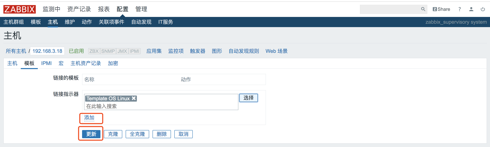

## 添加一台监控主机
### 实验环境
* Server host: CentOS7 192.168.3.18
* Agent host:  CentOS7 192.168.3.18
* Zabbix 3.2.6

之前我们成功安装了zabbix3.2.6，并且可以访问server host端的web界面进行各种操作，现在我们需要手动添加一台监控host来尝试一下zabbix的各种功能。这一次的实验我是直接在同一台centos上安装server端和agent端，并且已经配置好了`/usr/local/zabbix/etc/zabbix_agentd.conf`(如果忘记了如何配置agent端，可以回看我之前的笔记[zabbix源码安装配置实例](https://github.com/pppineapple/Zabbix-Note/blob/master/zabbix%E6%BA%90%E7%A0%81%E5%8C%85%E5%AE%89%E8%A3%85%E9%85%8D%E7%BD%AE/zabbix%E5%AE%89%E8%A3%85%E5%AE%9E%E4%BE%8B.md))，本文相当于利用zabbix监控本机的情况。  

首先打开浏览器**http:/.192.168.3.18/zabbix**，登录zabbix server的web端，默认用户名密码是admin/zabbix。(注：在安装zabbix server端时，我是将zabbix源码包下的php文件拷贝到apache发布目录`/var/www/html/zabbix`中，所以我进入zabbix server的web端是在server端ip地址后加上zabbix)  

  

接下来进入**配置**下的**主机**页面中**创建主机**。 
 
  

在创建主机下的主机页面中，填写

* 主机名称 (一定要与agent端的配置文件中的Hostname项一致)
* 可见名称 (用于展示的名称) 
* 群组    (用于后续监控展示时的分组)
* agent程序代理接口  （这里需要填写正确的agent端ip）
* 启用agent代理程序监测 （勾选即可）  

然后点击**添加**  

  

这时你会跳转到主机页面，可以看到新添加的监控主机的简要信息，但此时只是把这个监控主机加入了监控列表，还需要给这个主机添加对应的监控项，这里我们不一一添加监控项了，直接添加一个linux os的**监控模板**。  

  

点击我们刚刚添加的主机，进入该主机的配置页面，点击**模板**，然后点击**选择**，在弹窗页面中找到并勾选**template linux os**，下拉到弹窗底部点击**选择**，回到主机配置界面，点击**添加**和**更新**。  

  

这时跳转到主机页面，你会看到添加的监控主机的**应用集**、**监控项**、**触发器**后面都有数字，并且可用性中的**ZBX**显示为绿色，这就表示agent host已经应用了template linux os监控模板，成功进行zabbix监控了。  

  

此时，你还可以点击**监测中**下的**图形**，选择对应的**群组**、**主机**、**图形**刷新一下，就可以看到zabbix自动绘制的相关监控信息图表了。

### 至此我们搞定了在server web端新增一台监控主机，并添加监控模板，接下来：

* 了解不同监控项的具体内容
* 了解监控项的触发器含义
* 了解监控数据的存取

 
 
