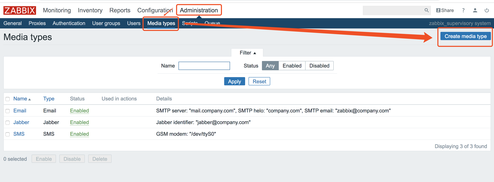
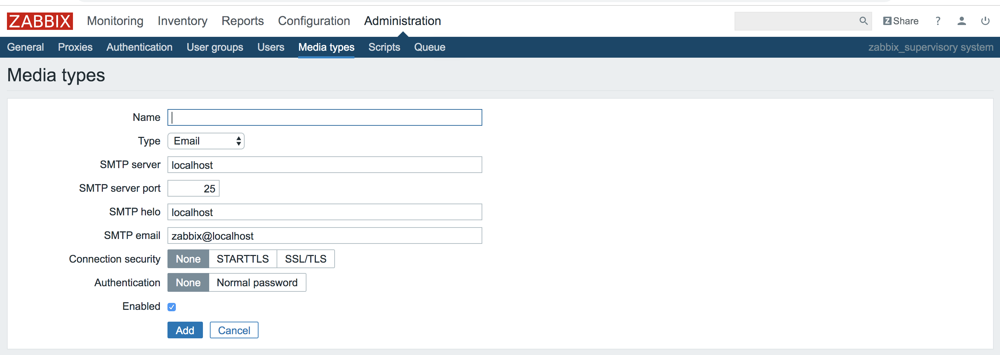
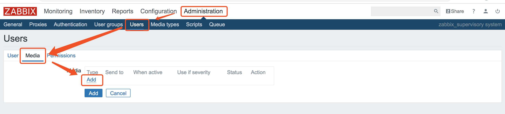
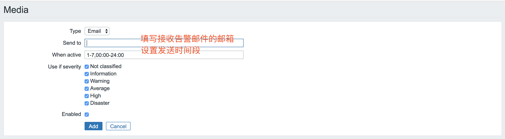
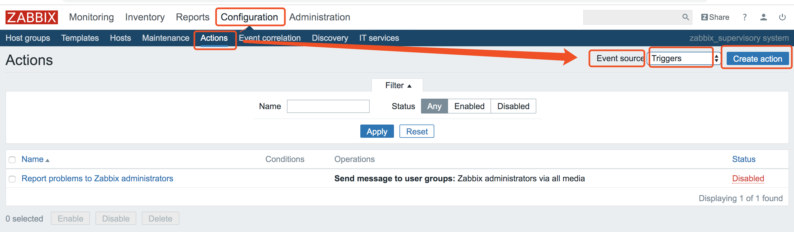
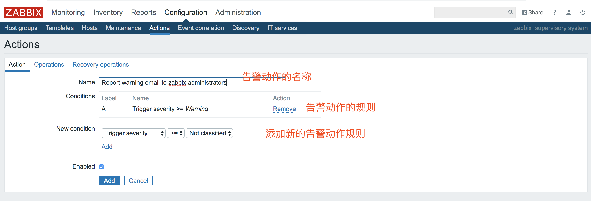
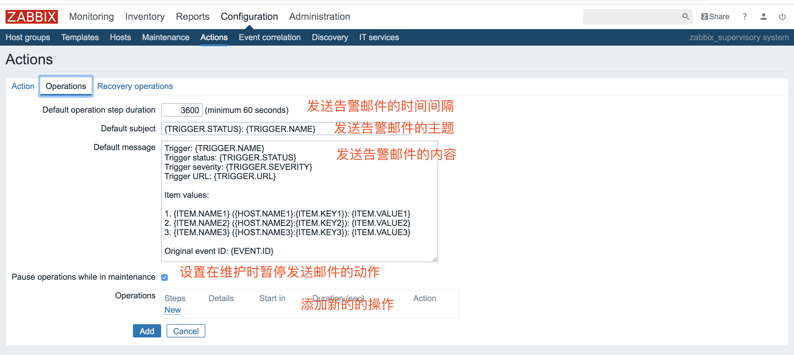
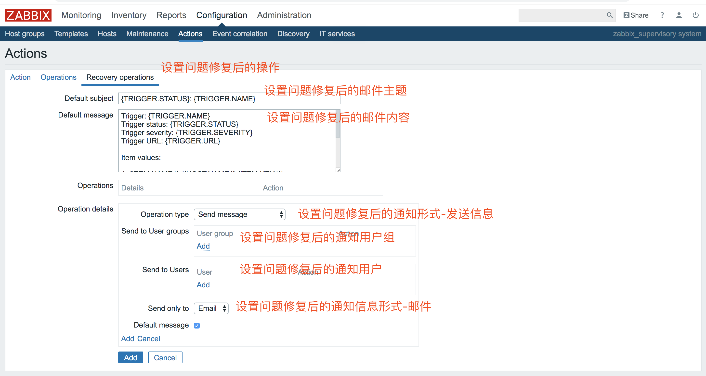

## zabbix邮件报警

Zabbix可以在server端设置邮件报警，当被监控的主机出现问题，到达触发器设置的阈值，就可以自动发送邮件通知运维工程师及时处理问题。

### 1.设置发送方邮件服务器
在zabbix server的web端，进入Administration -> Mediatypes -> Create mediatype，填写邮件服务器信息。

### 2.设置接收方邮箱
在zabbix server的web端，进入Administration -> Users -> Create User，填写接收告警邮件邮箱信息。

### 3.添加触发器
之后我们需要设置一个触发器，当zabbix监控到达阈值时触发邮件告警. 
Configuration -> Actions -> Action -> Event source -> Triggers -> Create Action

#### 现在大功告成，一旦各个监控项item出现warning，就会自动发送邮件通知zabbix用户。
