# zabbix邮件告警
* 配置mailx，编写邮件发送脚本
* 创建告警媒介
* 给用户添加告警媒介
* 给用户配置告警操作
* 告警实例

## 配置mailx，编写邮件发送脚本
### 安装配置mailx
```
[root@centos-linux pineapple]# yum install mailx
```

在mailx配置文件```/etc/mail.rc```中加入接收告警邮件的邮箱的相关配置信息。
注：以下的配置信息只是例子，并不是真实邮箱。其中smtp-auth-password可以在163邮箱设置 -> 客户端授权密码中进行配置。

```
set from=ZabbixLearner@163.com
set smtp=smtp.163.com
set smtp-auth-user=ZabbixLearner@163.com
set smtp-auth-password=123456789
set smtp-auth=login
```
配置好之后，我们可以在命令行进行测试，看是否可以通过命令发送邮件到ZabbixLearner@163邮箱。如果没有报错，就可以登录163进行查看，可以看到收到了一份主题为mail test，内容为hello world的邮件。

```
[root@centos-linux pineapple]# echo "hello world" |mailx -s "mail test" hongyaoqing@163.com
```

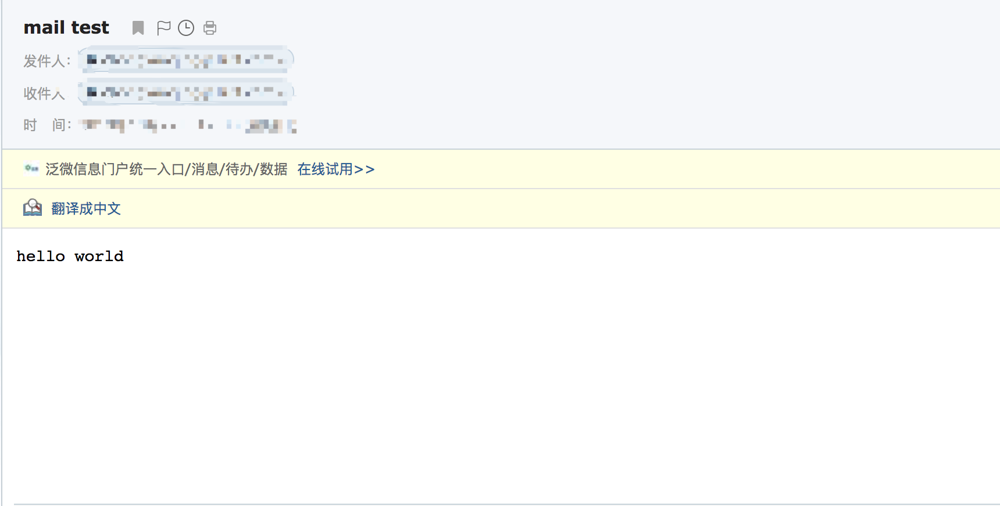

### 编写zabbix告警邮件脚本
zabbix告警脚本默认目录位于`/usr/local/zabbix/share/zabbix/alertscripts`(注：这个可以通过查看zabbix_server.conf中的 `# AlertScriptsPath=${datadir}/zabbix/alertscripts`来获取)，我们在该目录下新建一个shell脚本`jiaoben.sh`。这个脚本接收三个参数：SENT_TO、SENT_SUBJECT和SENT_CONTENT，分别表示告警邮件接收人、告警邮件主题和告警内容。

```
#!/bin/bash

SENT_TO=$1
SENT_SUBJECT=$2
SENT_CONTENT="/tmp/alert_$$.tmp"
echo "$3">$SENT_CONTENT

dos2unix $SENT_CONTENT
mailx -s "$SENT_SUBJECT" $SENT_TO < $SENT_CONTENT
```
测试一下脚本是否可用，如果未报错，且邮箱收到邮件则说明该脚本可成功运行。

```
# 先给脚本加上可执行权限
[root@centos-linux alertscripts]# chmod 755 mail.sh
[root@centos-linux alertscripts]# ./mail.sh ZabbixLearner@163.com "mail test1" "helloworld1"
./mail.sh:行8: dos2unix: 未找到命令
# 报错说未安装dos2unix，需要安装dos2unix
[root@centos-linux alertscripts]# yum install dos2unix
[root@centos-linux alertscripts]# ./mail.sh ZabbixLearner@163.com "mail test1" "helloworld1"
```

## 创建告警媒介
zabbix默认自带Email、Jabber和SMS三种告警媒介。
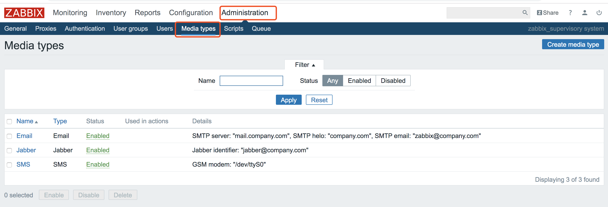

我们创建一个自定义的告警媒介ZabbixLearnAlertMedia。
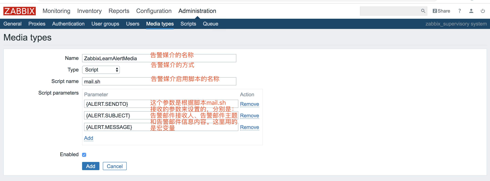

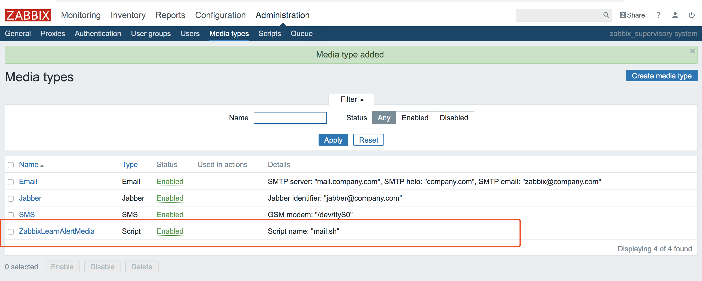

## 给用户添加告警媒介
接下来我们给用户pppineapple添加告警媒介ZabbixLearnAlertMedia。

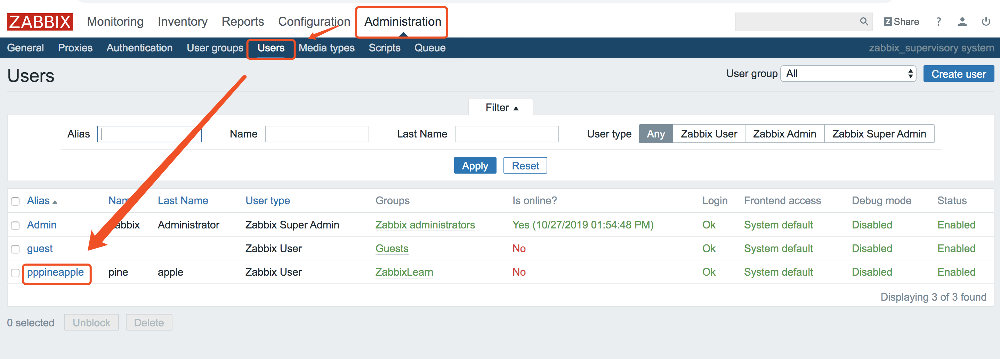
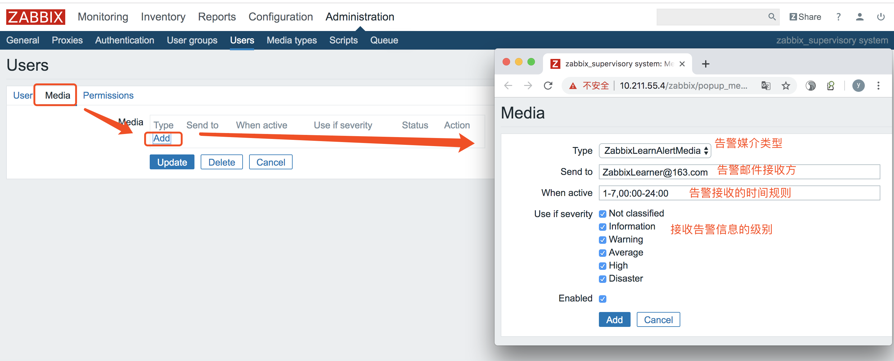


## 给用户配置告警操作
zabbix默认操作会将告警通过邮件发送给超级管理员。
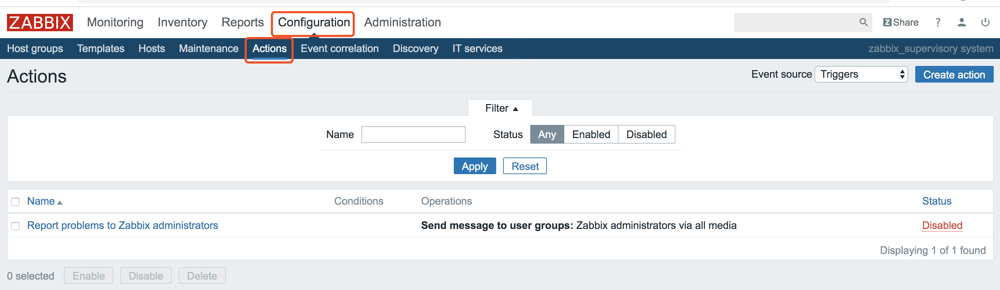

我们创建一个名为EmailAlert的action来执行告警。分别设置好Actoin、发送故障告警邮件和发送故障恢复邮件。注：故障告警信息和故障恢复信息的具体内容见文末。
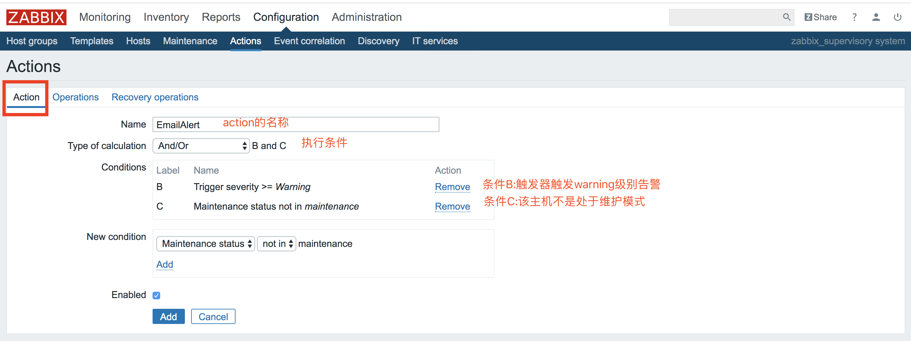
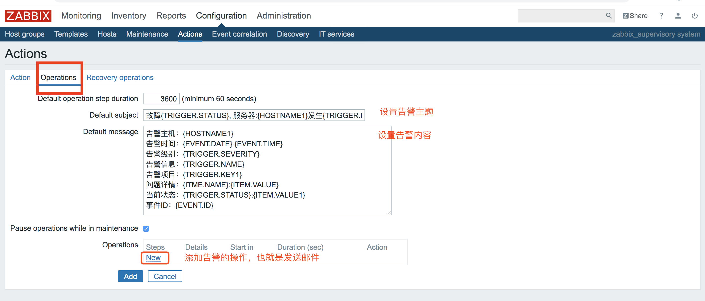
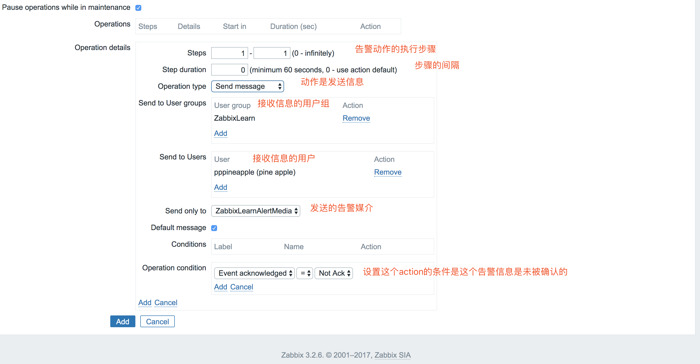
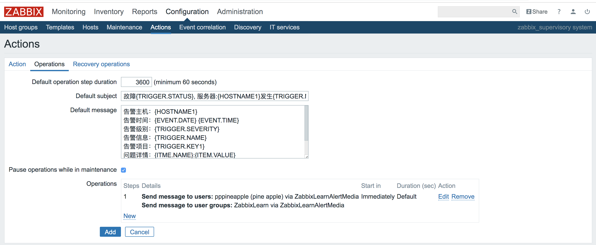
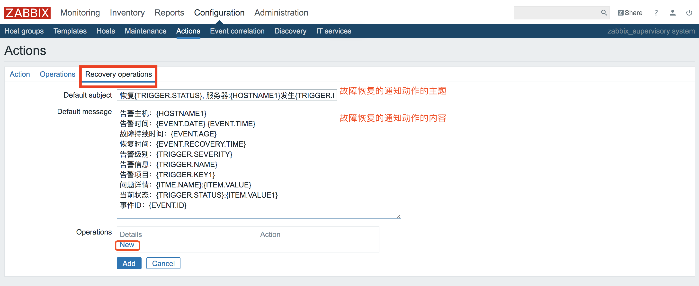
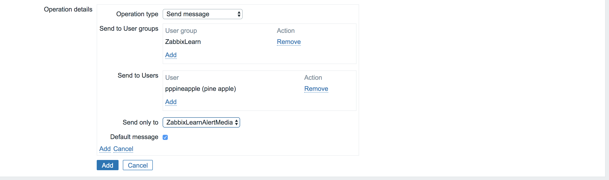
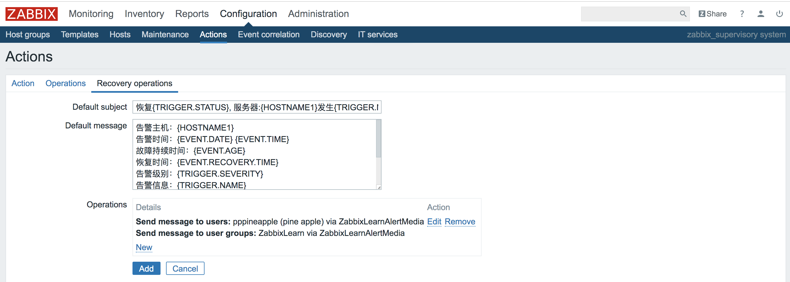

这样，一个action就设置好了，它表示，当未处于维护状态，并且触发器达到warning级别的报警，就会发送故障告警邮件到指定邮箱，并且故障恢复后，会发送故障恢复邮件到指定邮箱。
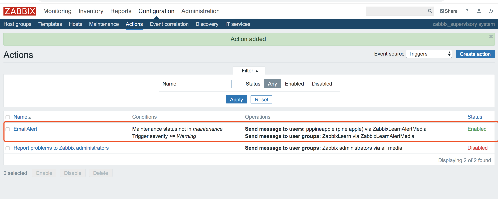

## 告警实例
还记得我们之前设置的自定义[监控项pythontest\_log_monitor](https://github.com/pppineapple/Zabbix-Note/blob/master/zabbix%E8%87%AA%E5%AE%9A%E4%B9%89%E7%9B%91%E6%8E%A7%E9%A1%B9/zabbix%E8%87%AA%E5%AE%9A%E4%B9%89%E7%9B%91%E6%8E%A7.md)吗？

>情况模拟：
>我用python写了一个脚本，启动脚本后，它会自动在脚本当前目录下每隔1秒钟往pyhtontext.log文件中逐行递归依次写入0-99一共100个数字，然后我让zabbix来监控pythontext.log文件中的最后一行，一旦最
>后一行的值为95，就实现告警。

我们先看一下这个监控项的图形状况：目前pythontest\_log\_monitor监控项的最新值是小于95的，所以现在没有触发报警。
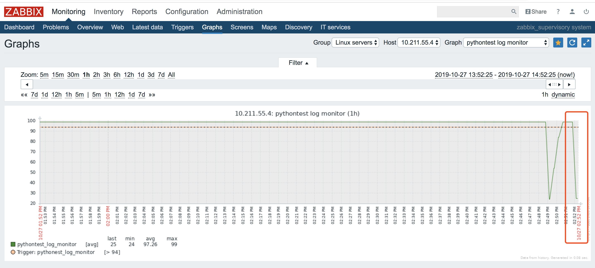
我们让pythontest.log文件中最后一行的数字大于等于95后，图形的情况如下所示：
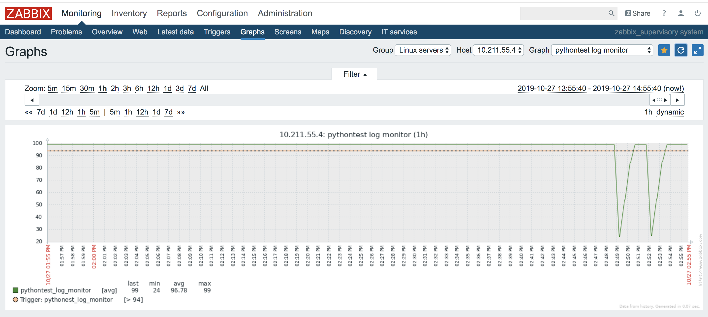

现在我们看一下monitor界面下的problem标签页，可以看到zabbix开始报告发现故障问题了。并且我们把鼠标悬停到action列的Done上，可以看到zabbix已经执行了发送告警邮件给用户pppineapple的信息提示。
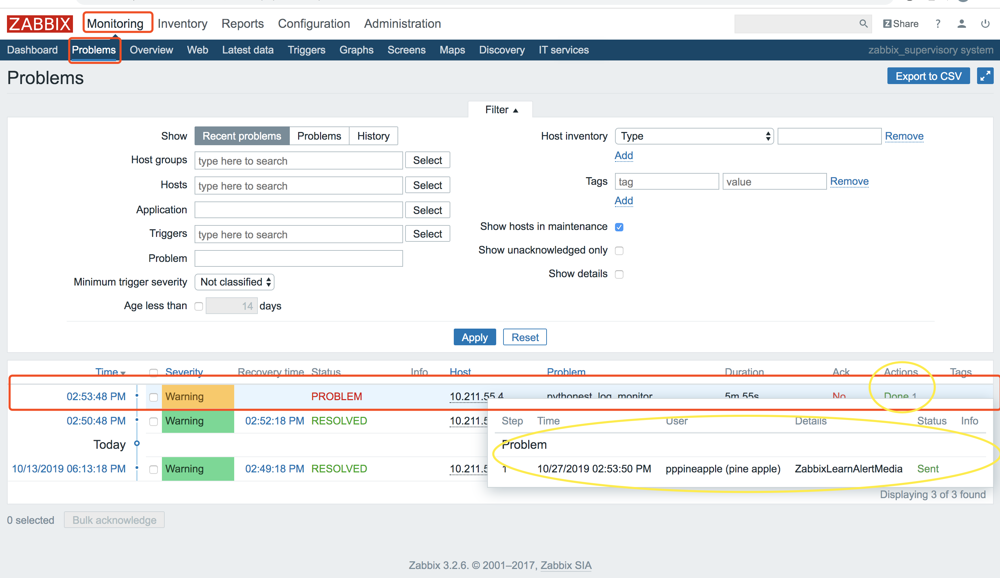

检查一下我们的邮箱。可以发现告警邮件已经发送了。
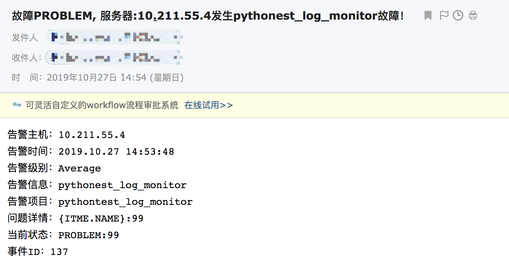

现在我们将pythontest.log文件中最后一行的数字修改为80，这样就不会触发告警了。可以发现之前的故障告警变为”RESOVELD“了。并且zabbix也将故障恢复的邮件发送给用户pppineapple了。
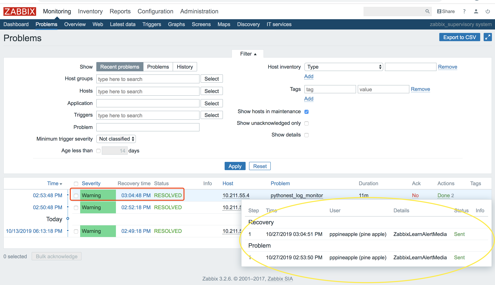

检查一下我们的邮箱。可以发现告警恢复邮件已经发送了。
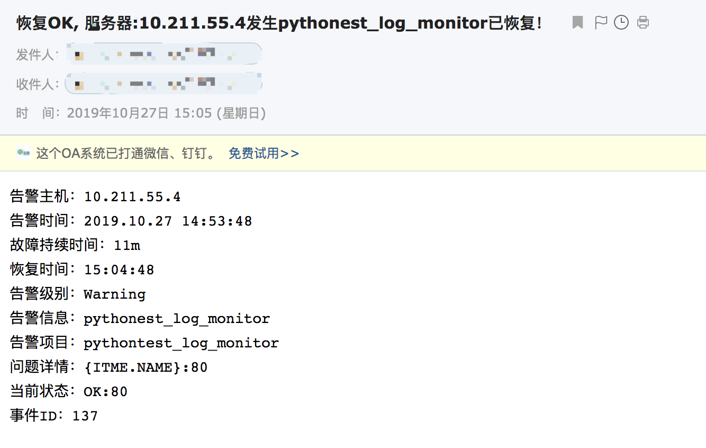

## 总结
至此，我们就完成了zabbix监控项超过阈值，触发器告警，执行预先设置的动作，发送邮件告警给用户这一整套流程。总结起来就是：监控项 --> 触发器 --> Action --> 邮件告警。
当然，实际工作中，不仅仅只是邮件告警这一项，还有微信告警和短信告警，并且告警媒介也不仅仅只是用shell脚本来执行，还可以用通过邮件服务器来执行。这些内容就等我后续慢慢学习和探索了！

#### 附件
* 告警信息主题

	`故障{TRIGGER.STATUS}, 服务器:{HOSTNAME1}发生{TRIGGER.NAME}故障！`
	
* 告警信息内容
	
	```
	告警主机：{HOSTNAME1}
	告警时间：{EVENT.DATE} {EVENT.TIME}
	告警级别：{TRIGGER.SEVERITY}
	告警信息：{TRIGGER.NAME}
	告警项目：{TRIGGER.KEY1}
	问题详情：{ITME.NAME}:{ITEM.VALUE}
	当前状态：{TRIGGER.STATUS}:{ITEM.VALUE1}
	事件ID：{EVENT.ID}
	```
	
* 告警恢复信息主题

	`恢复{TRIGGER.STATUS}, 服务器:{HOSTNAME1}发生{TRIGGER.NAME}已恢复！`
	
* 告警恢复信息内容
	
	```
	告警主机：{HOSTNAME1}
	告警时间：{EVENT.DATE} {EVENT.TIME}
	故障持续时间：{EVENT.AGE}
	恢复时间：{EVENT.RECOVERY.TIME}
	告警级别：{TRIGGER.SEVERITY}
	告警信息：{TRIGGER.NAME}
	告警项目：{TRIGGER.KEY1}
	问题详情：{ITME.NAME}:{ITEM.VALUE}
	当前状态：{TRIGGER.STATUS}:{ITEM.VALUE1}
	事件ID：{EVENT.ID}
	```


