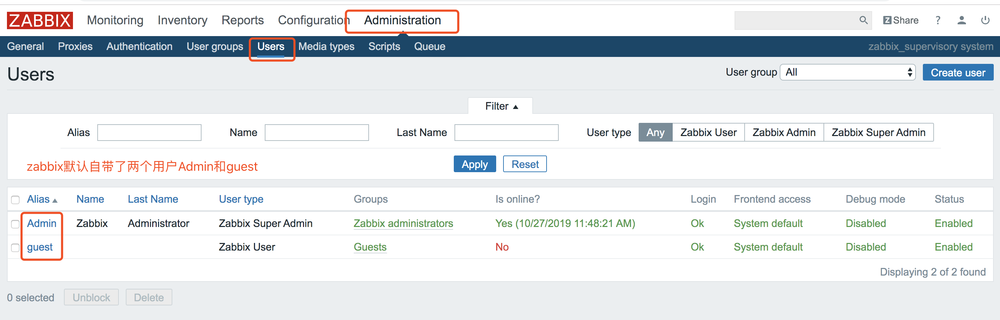
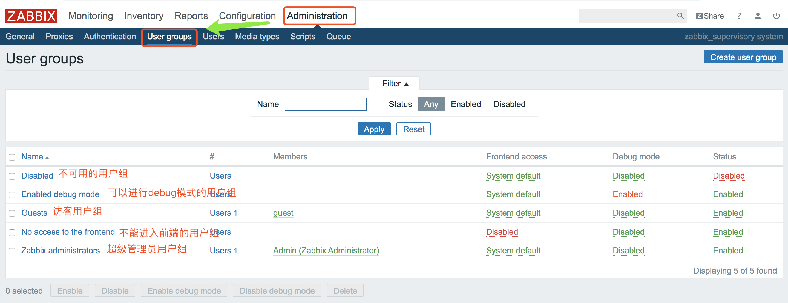
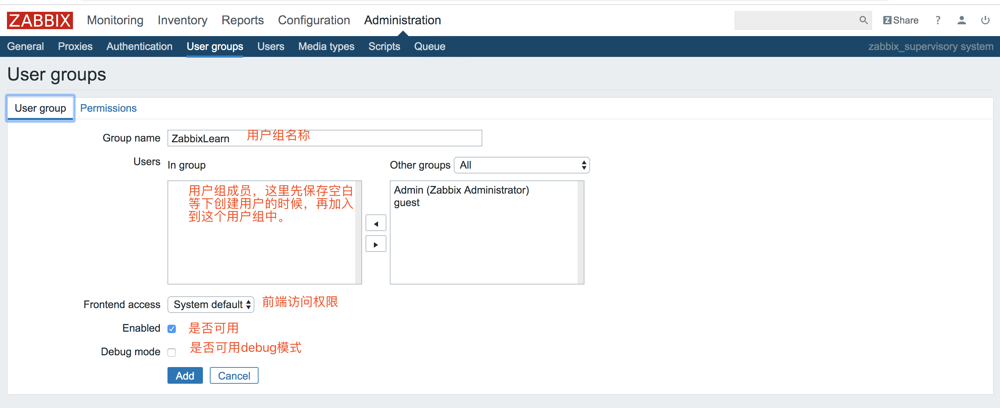
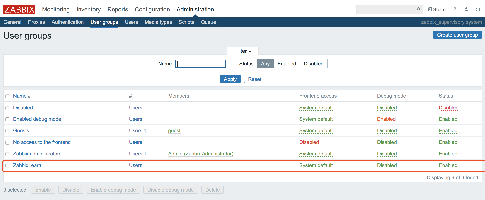
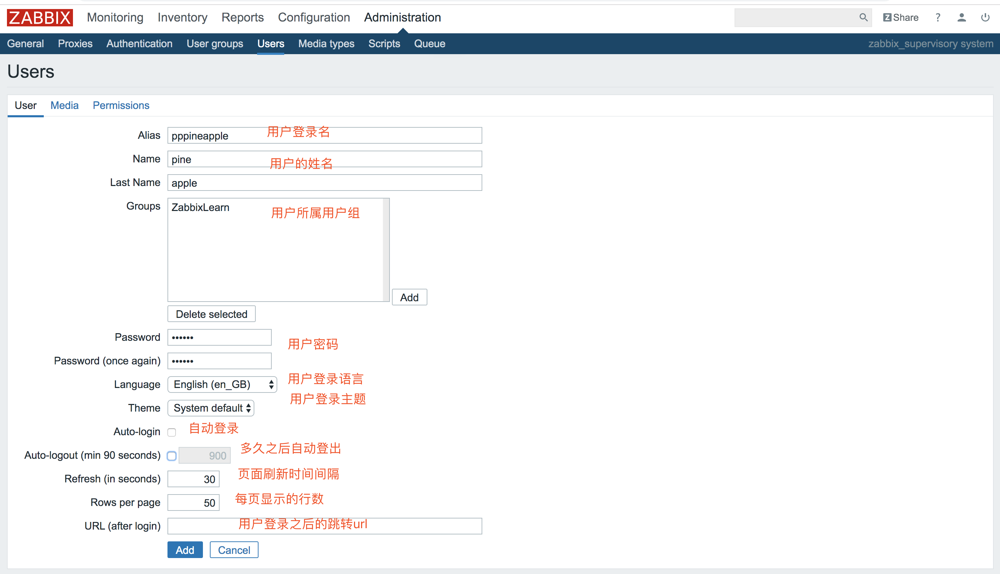
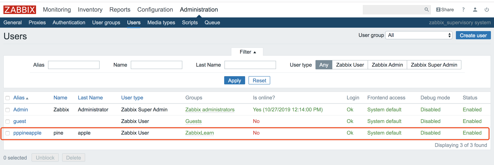

# zabbix用户操作
* zabbix创建用户组
* zabbix创建用户

zabbix默认创建了两个用户：Admin、Guest

## zabbix创建用户组
zabbix默认创建了5个用户组，如下所示：

接下来创建一个ZabbixLearner用户组，并给这个用户组配置Linux server主机组的读写权限。

成功创建了ZabbixLearner用户组

## zabbix创建用户
zabbix默认创建了两个用户：Admin、Guest。如下所示

接下来创建一个pppineapple用户，并将它加入ZabbixLearner用户组

成功创建了pppineapple用户

