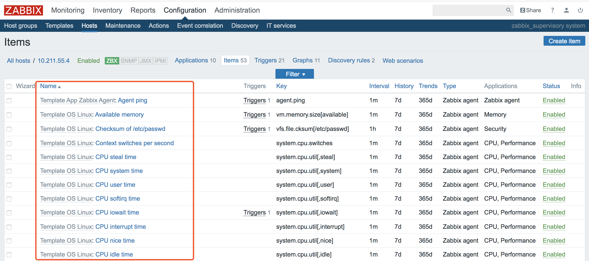
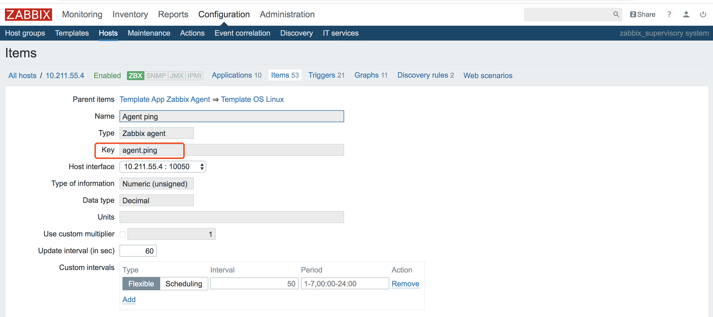

## zabbix_get获取数据

zabbix_get命令可以在调试阶段用来获取指定host的相关item的key值数据。<br>  

例如获取远程主机的名称和内核版本

```
[root@MiWiFi-R1CM-srv zabbix-3.2.6]# /usr/local/zabbix/bin/zabbix_get -s 10.211.55.4 -k system.uname
Linux centos-linux.shared 3.10.0-1062.el7.x86_64 #1 SMP Wed Aug 7 18:08:02 UTC 2019 x86_64
```

获取主机名

```
[root@MiWiFi-R1CM-srv zabbix-3.2.6]# /usr/local/zabbix/bin/zabbix_get -s 10.211.55.4 -k system.hostname
centos-linux.shared
```

监控主机中的每个item就是一个监控项，每一个item的key，它的数据可以用`/usr/local/zabbix/bin/zabbix_get -s 10.211.55.4 -k $keyname$ `l来获取。其中$keyname$表示每个item的key值，中间的ip地址就是每个监控主机的ip

  
  
然后将一个监控项Item的Agent Ping的Key复制出来，使用zabbix_get命令查询一下这个key的数据。返回值是1，说明ip10.211.55.4的agent端能够ping通。

```
[root@MiWiFi-R1CM-srv zabbix-3.2.6]# /usr/local/zabbix/bin/zabbix_get -s 10.211.55.4 -k agent.ping
1
```

注：key可以在`/usr/local/zabbix/etc/zabbix_agentd.conf`文件中添加

## zabbix自动发现
zabbix利用Discovery模块自动发现主机、将主机添加到主机组，自动创建Item，只要能ping通，就可以实现自动发现并监控。前提是要设置自动发现规则，并设置相应的动作。


## zabbix的主要配置文件
#### zabbix_server.conf配置文件参数  

|zabbix_server.conf配置参数|含义|
|:--|:---|
|DBHost|数据库主机地址|
|DBName|数据库名称|
|DBPassword|数据库密码|
|DBPort|数据库端口，默认3306|
|AlertScriptsPath|告警脚本存放路径|
|CacheSize|存储监控数据的缓存|
|CacheUpdateFrequency|更新一次缓存时间|
|DebugLevel|日志级别|
|LogFile|日志文件|
|LogFileSize|日志文件大小，超出自动切割|
|LogSlowQueries|数据库慢查询记录，毫秒|
|PidFile|PID文件|
|ProxyConfigFrequency|proxy被动模式下，server多少秒同步配置文件至proxy|
|ProxyDataFrequency|proxy被动模式下，server间隔多少秒向proxy请求历史数据|
|StartDiscoveres|发现规则线程数|
|Timeout|连接Agent超时时间|
|TrendCacheSize|历史数据缓存大小|
|Uesr|zabbix运行的用户|
|HistoryCacheSize|历史缓存大小|
|ListenIp|简单本机的IP地址|
|ListenPort|监听端口|
|LoadModule|模块名称|
|LoadModulePath|模块路径|


#### Zabbix_Proxy.conf配置文件参数详解

|Zabbix_Proxy.conf配置参数|含义|
|:--|:---|
|ProxyMode|Proxy工作模式，默认为主动模式，主动发送数据至server；被动模式是等待server抓取数据|
|Server|指定Server端地址|
|ServerPort|Server端port端口|
|Hostname|Proxy端主机名|
|ListenPort|Proxy端监听端口|
|LogFile|Proxy代理端日志路径|
|PidFile|PID文件路径|
|DBHost|Proxy端数据库主机地址|
|DBName|Proxy端数据库名称|
|DBUser|Proxy端数据库用户|
|DBPassword|Proxy端数据库密码|
|DBSocket|Proxy端数据库SOCKET路径|
|DBPort|Proxy端数据库端口，默认3306|
|DataSenderFrequency|Proxy想Server发送数据时间间隔|
|StartPollers|Proxy线程池数量|
|CacheSize|内存缓存配置|
|StartDBSyncers|同步数据线程数|
|HistoryCacheSize|历史数据缓存大小|
|LogSlowQueries|数据库慢查询记录，毫秒|
|Timeout|连接Agent超时时间|
  
  

#### Zabbix_aggentd.conf配置文件参数详解
 
|Zabbix_aggentd.conf配置参数|含义|
|:--|:---|
|EnableRemoteCommands|运行服务端远程至客户端致谢命令或脚本|
|Hostname|客户端主机名|
|ListenIP|监听的IP地址|
|ListenPort|客户端监听单口|
|LoadModulePath|模块路径|
|LogFile|日志文件路径|
|PidFile|PID文件名|
|Server|指定Server端IP地址|
|ServerActive|Zabbix主动监控server端的ip地址|
|StartAgents|Agent启动进程，如果设置为0，表示禁用被动监控|
|Timeout|超时时间|
|User|运行Zabbix的用户|
|UserParameter|用户自定义key|
|BufferSize|缓冲区大小|
|DebugLevel|Zabbix日志级别|  


## zabbix的主动监控与被动监控模式
zabbix监控客户端分为**主动监控**和**被动监控**，zabbix监控客户端默认为被动模式。修改为主动模式需要在客户端配置文件中添加ServerActive指定zabbix主动监控的server端ip地址。关闭被动模式只需要在客户端配置文件中加入StartAgents=0，即为关闭被动模式。

* 主动监控模式：Agent主动请求Server获取agent的监控项列表，并主动将监控项内需要检测的数据提交给server/proxy，zabbix agent首先向serverActive配置的ip请求获取activeitems，获取并提交activeitems数据值到server/proxy。
* 被动监控模式：Server向Agent请求获取监控项的数据，Agent返回数据，Server打开一个TCP连接，Server发送请求agent.ping，Agent接收到请求并且响应，Server处理接收到的数据。

## 自定义zabbix监控项