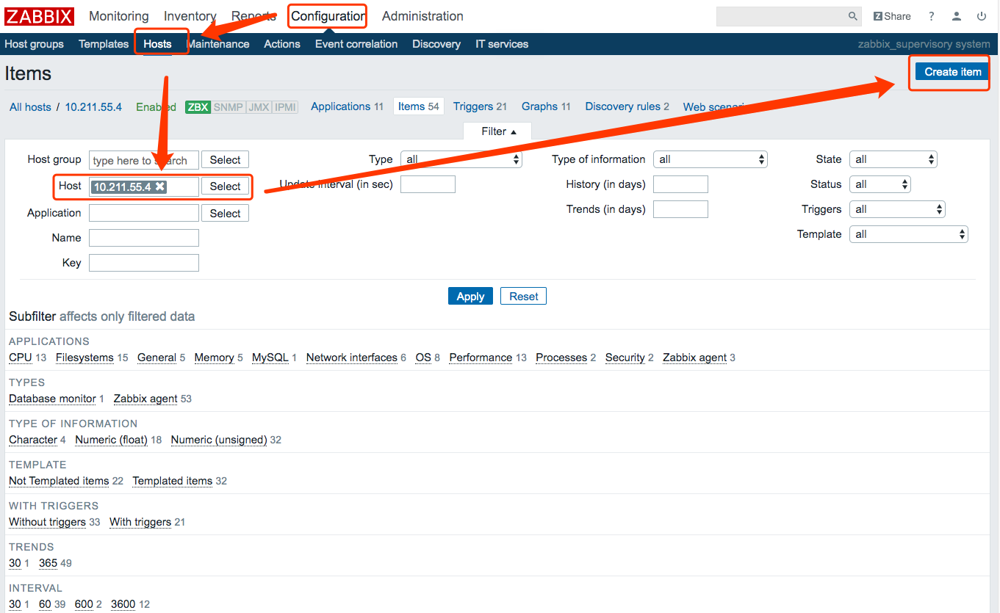
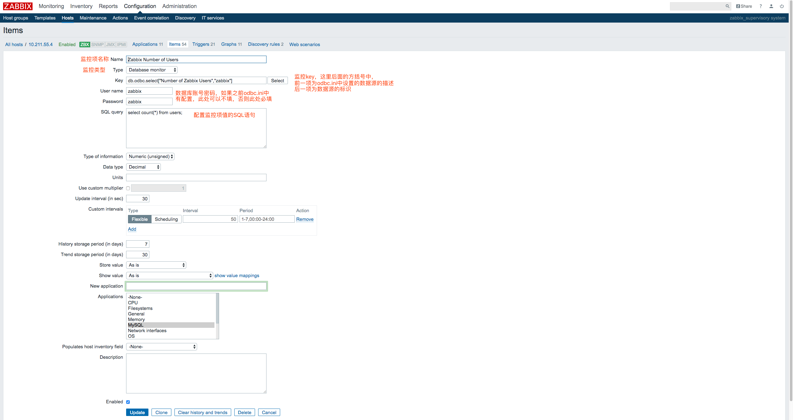
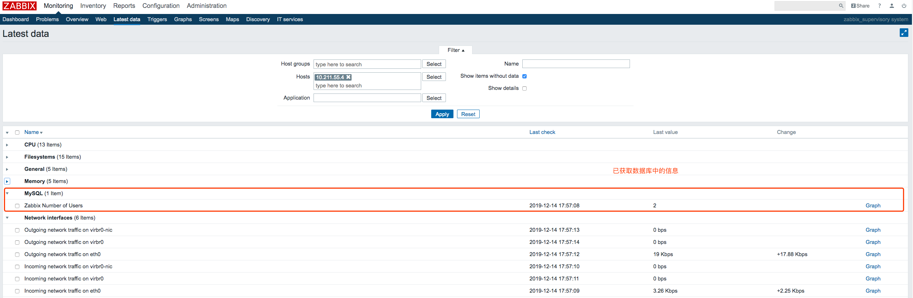
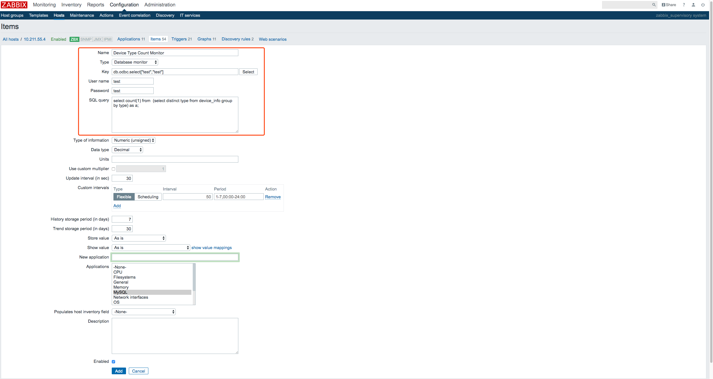
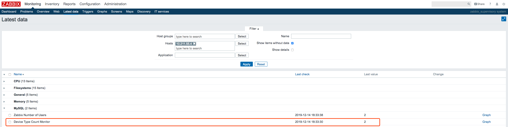

# Zabbix数据库监控
* 概述
* 安装、配置unixODBC驱动
* 自定义数据库监控项
* 填坑

## 概述
Zabbix提供了数据库监控功能：**ODBC监控**
>
>
>ODBC监控对应于Zabbix Web管理端中的数据库监控器监控项类型。
>ODBC是用于访问数据库管理系统（DBMS）的C语言中间件API。ODBC由Microsoft开发，后来移植到其它平台。
>
>Zabbix可以查询ODBC支持的任何数据库。为了实现监控，Zabbix不直接连接到数据库，而是使用ODBC中设置的ODBC接口和驱动。该功能允许为多个目的更加有效地监控不同的数据库 - 例如，监控特定的数据库队列、使用统计信息等。 Zabbix支持unixODBC，它是最常用的开源ODBC API实现之一。

## 安装、配置unixODBC驱动
### 1. 检查是否具备ODBC
在安装安装、配置unixODBC驱动之前，我们先要确定zabbix server端是否支持ODBC监控。查看方式很简单，我们对zabbix_server重启，然后查看启动日志中的内容。

注：因为我最开始在安装编译zabbix server端时进行了软链接，并加入了系统服务，详见[zabbix安装实例](https://github.com/pppineapple/Zabbix-Note/blob/master/zabbix%E6%BA%90%E7%A0%81%E5%8C%85%E5%AE%89%E8%A3%85%E9%85%8D%E7%BD%AE/zabbix%E5%AE%89%E8%A3%85%E5%AE%9E%E4%BE%8B.md),所以我的zabbix-server服务启动就直接是`/etc/init.d/zabbix_server start`；重启就是`/etc/init.d/zabbix_server restart`；停止就是`/etc/init.d/zabbix_server stop`；

```
# 建立软链接
[root@MiWiFi-R1CM-srv zabbix-3.2.6]# ln -s /usr/local/zabbix/sbin/zabbix_* /usr/local/sbin/
# 加入系统服务
[root@MiWiFi-R1CM-srv etc]# cp /home/pineapple/zabbix-3.2.6/misc/init.d/tru64/zabbix_server /etc/init.d/zabbix_server
[root@MiWiFi-R1CM-srv etc]# chmod o+x /etc/init.d/zabbix_server 
[root@MiWiFi-R1CM-srv etc]# /etc/init.d/zabbix_server start
```

重启zabbix_ server服务之后，就去`/tmp/zabbix_server.log`中查看如下zabbix_server日志片段：

```
18888:20191214:152119.611 ****** Enabled features ******
 18888:20191214:152119.611 SNMP monitoring:           YES
 18888:20191214:152119.611 IPMI monitoring:            NO
 18888:20191214:152119.611 Web monitoring:            YES
 18888:20191214:152119.611 VMware monitoring:         YES
 18888:20191214:152119.611 SMTP authentication:       YES
 18888:20191214:152119.611 Jabber notifications:       NO
 18888:20191214:152119.611 Ez Texting notifications:  YES
 18888:20191214:152119.611 ODBC:                      YES
 18888:20191214:152119.611 SSH2 support:               NO
 18888:20191214:152119.611 IPv6 support:              YES
 18888:20191214:152119.611 TLS support:                NO
 18888:20191214:152119.611 ******************************

```

其中ODBC对应项为YES，表示该zabbix_server端具备监控数据库功能。
如果ODBC对应项为NO，请先跳到4.填坑

### 2. 安装unixODBC
这个在[zabbix官网文档ODBC监控](https://www.zabbix.com/documentation/3.4/zh/manual/config/items/itemtypes/odbc_checks)中有详细的介绍:
>安装unixODBC
>>安装unixODBC的建议方法是使用Linux操作系统的默认软件包存储库。在流行的Linux发行版中，unixODBC默认包含在软件包存储库中。如果不可用，可以在unixODBC主页获取：http://www.unixodbc.org/download.html.

>>使用yum包管理器在基于RedHat/Fedora的系统上安装unixODBC：
>>`yum -y install unixODBC unixODBC-devel`

>安装unixODBC驱动
>>应该为将要被监控的数据库安装unixODBC数据库驱动。 unixODBC有一个受支持的数据库和驱动程序的列表：http://www.unixodbc.org/drivers.html. 在一些Linux发行版中，数据库驱动程序包含在包存储库中。使用yum包管理器在基于RedHat/Fedora的系统上安装MySQL数据库驱动:`yum install mysql-connector-odbc`

#### 3. 配置unixODBC
配置unixODBC官网上讲的很简单，但是实际操作中并不容易。
我们安装好unixODBC和驱动之后，先查看一下ODBC的配置信息。

```
# 查看odbc的信息
[root@centos-linux ~]# odbcinst -j
unixODBC 2.3.1
DRIVERS............: /etc/odbcinst.ini
SYSTEM DATA SOURCES: /etc/odbc.ini
FILE DATA SOURCES..: /etc/ODBCDataSources
USER DATA SOURCES..: /root/.odbc.ini
SQLULEN Size.......: 8
SQLLEN Size........: 8
SQLSETPOSIROW Size.: 8

```
这里可以看到odbc的驱动版本unixODBC 2.3.1、驱动程序/etc/odbcinst.ini、系统数据/文件数据/用户数据源等等。我们先看一下已经安装的ODBC驱动程序涉及哪些数据库:

```
[root@centos-linux ~]# cat /etc/odbcinst.ini
# Example driver definitions

# Driver from the postgresql-odbc package
# Setup from the unixODBC package
[PostgreSQL]
Description	= ODBC for PostgreSQL
Driver		= /usr/lib/psqlodbcw.so
Setup		= /usr/lib/libodbcpsqlS.so
Driver64	= /usr/lib64/psqlodbcw.so
Setup64		= /usr/lib64/libodbcpsqlS.so
FileUsage	= 1


# Driver from the mysql-connector-odbc package
# Setup from the unixODBC package
[MySQL]
Description	= ODBC for MySQL
Driver		= /usr/lib/libmyodbc5.so
Setup		= /usr/lib/libodbcmyS.so
Driver64	= /usr/lib64/libmyodbc5.so
Setup64		= /usr/lib64/libodbcmyS.so
FileUsage	= 1

```
返回的cat结果说明，目前ODBC驱动支持**postgres**和**mysql**两种数据库，接下来我们在`/etc/odbc.ini`中定义mysql数据源。

```
[root@centos-linux ~]# vi /etc/odbc.ini
[zabbix]                         # 数据源的标识，重要
Description = MySQL zabbix DB    # 数据源的描述，次要
Driver = mysql                   # 数据源的ODBC驱动，重要
Server = localhost               # 数据源的ip地址， 重要
User = zabbix                    # 数据源的用户， 重要(可不写，后续配置item时再写)
Password = zabbix                # 数据源的用户密码, 重要(可不写，后续配置item时再写)
Port = 3306                      # 数据源端口，重要
Database = zabbix                # 数据源的数据库，重要
```

定义数据源之后，我们需要对上述的ODBC的配置进行验证测试，出现如下结果表示，数据源配置成功。

```
[root@centos-linux ~]# isql zabbix
+---------------------------------------+
| Connected!                            |
|                                       |
| sql-statement                         |
| help [tablename]                      |
| quit                                  |
|                                       |
+---------------------------------------+
SQL> 

```

此时的命令行前缀变成`SQL>`，这表示我们进入了一个SQL命令台，可以进行SQL语句操作，比如：**我查询了zabbix数据库中的表users，查询users里面有多少个用户**。

```
SQL> show databases;
+-------------------------+
| Database                |
+-------------------------+
| information_schema      |
| test                    |
| zabbix                  |
+-------------------------+
SQLRowCount returns 3
3 rows fetched
SQL> use zabbix;
SQLRowCount returns 0
SQL> select count(*) from users;
+---------------------+
| count(*)            |
+---------------------+
| 2                   |
+---------------------+
SQLRowCount returns 1
1 rows fetched
```

## 自定义数据库监控项
### 1. 监控zabbix用户数量
现在需要到zabbix的web前台界面中添加数据库的item监控项，例如：我想要监控zabbix数据库中users表中的用户数量，即构建一个监控项，对SQL语句`select count(*) from users;`的结果进行监控。

首先找到监控数据库所在的目标主机，新建item。然后在进入Lastest data中查看是否有数据抓取。







注: 此处的SQL查询语句有要求，官网有详细的说明
>重要信息
>
>>* 该查询的执行时间不能超过服务器上的Timeout参数。从Zabbix 2.0.8开始，Timeout参数值也用作ODBC登录超时（请注意，根据ODBC驱动程序，登录超时设置可能会被忽略）。
>>* 该查询只能返回一个值。
>>* 如果查询返回多个列，则只读取第一列。
>>* 如果查询返回多行，则只读取第一行。
>>* SQL命令必须以select开始。
>>* SQL命令不能包含任何换行符

### 2. 自定义数据库监控实例
现在有device_info如下所示：

|owner|device_name|type|complete_status|
|-----|-----------|----|---------------|
|xiaowang|	device1|	X86	|<center>1</center>|
|xiaozhang|	device2|	X86	|<center>0</center>|
|xiaoli|	device3|	ARM	|<center>1</center>|
我们需要对这个表监控一共有多少种不同的type类型，在数据库中的SQL查询语句为：

```
SQL> select count(1) from  (select distinct type from device_info group by type) as a;
+---------------------+
| count(1)            |
+---------------------+
| 2                   |
+---------------------+
SQLRowCount returns 1
```

那么现在首先在`/etc/odbc.ini`中配置数据源，并验证配置成功

```
[test]
Description = test
Driver = mysql
Server = localhost
User = 
password = 
Port = 3306
Database = test

# 验证配置，成功
[root@centos-linux ~]# isql -v test
+---------------------------------------+
| Connected!                            |
|                                       |
| sql-statement                         |
| help [tablename]                      |
| quit                                  |
|                                       |
+---------------------------------------+
SQL> 
```

然后在zabbix的web前端界面添加监控项


添加监控项成功获取到了数据


至此，自定义数据库监控项完成！

## 填坑

我重启zabbix server服务之后，查看日志发现ODBC对应为NO。WTF

```
 16785:20191214:135812.803 Starting Zabbix Server. Zabbix 3.2.6 (revision 67849).
 16785:20191214:135812.803 ****** Enabled features ******
 16785:20191214:135812.803 SNMP monitoring:           YES
 16785:20191214:135812.803 IPMI monitoring:            NO
 16785:20191214:135812.803 Web monitoring:            YES
 16785:20191214:135812.803 VMware monitoring:          NO
 16785:20191214:135812.803 SMTP authentication:       YES
 16785:20191214:135812.803 Jabber notifications:       NO
 16785:20191214:135812.803 Ez Texting notifications:  YES
 16785:20191214:135812.803 ODBC:                       NO
 16785:20191214:135812.803 SSH2 support:               NO
 16785:20191214:135812.803 IPv6 support:              YES
 16785:20191214:135812.803 TLS support:                NO
 16785:20191214:135812.803 ******************************
 16785:20191214:135812.803 using configuration file: /usr/local/zabbix/etc/zabbix_server.conf
 16785:20191214:135812.807 current database version (mandatory/optional): 03020000/03020000
 16785:20191214:135812.807 required mandatory version: 03020000

```

网上搜了一圈，需要重新编译zabbix server，在编译时加上参数项`--with-unixodbc`，没办法，预审重新编译安装zabbix server。


```
./configure --prefix=/usr/local/zabbix/ --enable-server --enable-agent --with-mysql --enable-java --with-libxml2 --with-unixodbc --with-net-snmp --with-openipmi --with-ldap --with-libcurl --with-iconv 
make && make install
```

然后进入mysql建立zabbix数据库，并将zabbix数据库素有权限赋给数据库用户zabbix，导入zabbix安装包里的表结构到数据库zabbix中。

这里我忘记了之前的数据库zabbix用户的密码是123456，所以我重新设置了数据库用户zabbix密码为zabbix，然后由于我这手贱操作产生了一系列问题...

```
MariaDB [(none)]> create database zabbix character set utf8 collate utf8_bin;
Query OK, 1 row affected (0.00 sec)
MariaDB [(none)]> grant all privileges on zabbix.* to zabbix@localhost identified by 'zabbix';
Query OK, 0 rows affected (0.00 sec)
MariaDB [(none)]> flush privileges;
Query OK, 0 rows affected (0.00 sec)

# 导入表结构
[root@centos-linux ~]# mysql -uzabbix -pzabbix zabbix < /home/pineapple/zabbix-3.2.6/database/mysql/schema.sql 
[root@centos-linux ~]# mysql -uzabbix -pzabbix zabbix < /home/pineapple/zabbix-3.2.6/database/mysql/images.sql
[root@centos-linux ~]# mysql -uzabbix -pzabbix zabbix < /home/pineapple/zabbix-3.2.6/database/mysql/data.sql 

# 进入mysql可以看到zabbix数据库中已经导入了zabbix相关的表了
[root@centos-linux ~]# mysql -uzabbix -pzabbix zabbix 
Reading table information for completion of table and column names
You can turn off this feature to get a quicker startup with -A

Welcome to the MariaDB monitor.  Commands end with ; or \g.
Your MariaDB connection id is 86
Server version: 5.5.64-MariaDB MariaDB Server

Copyright (c) 2000, 2018, Oracle, MariaDB Corporation Ab and others.

Type 'help;' or '\h' for help. Type '\c' to clear the current input statement.

MariaDB [zabbix]> show tables;
+----------------------------+
| Tables_in_zabbix           |
+----------------------------+
| acknowledges               |
| actions                    |
| alerts                     |
| application_discovery      |
| application_prototype      |
| application_template       |
| applications               |
| auditlog                   |
| auditlog_details           |

# 修改一下zabbix-server.conf配置文件，使之与mysql的zabbix数据库适配
[root@centos-linux ~]# vi /usr/local/zabbix/etc/zabbix_server.conf
#####/usr/local/zabbix/etc/zabbix_server.conf########
DBHost=localhost
DBName=zabbix
DBUser=zabbix
DBPassword=zabbix

```
重启zabbix，浏览器输入http://192.168.34.7/zabbix，发现下面的报错:

```
####################
Error connecting to database: Access denied for user ‘zabbix’ @ ‘localhost’ to database ‘zabbix’(PASSWORD:YES)
####################
```

使用先前配置的数据库USER和PASSWORD登录数据库，发现无问题可以正常登陆数据库，猜想可能是Apache前端的配置里面除了问题，查看 `/var/www/html/zabbix/conf/zabbix.conf.php`，如下：

```
<?php
// Zabbix GUI configuration file.
global $DB;

$DB['TYPE']     = 'MYSQL';
$DB['SERVER']   = 'localhost';
$DB['PORT']     = '0';
$DB['DATABASE'] = 'zabbix';
$DB['USER']     = 'zabbix';
$DB['PASSWORD'] = '123456';

// Schema name. Used for IBM DB2 and PostgreSQL.
$DB['SCHEMA'] = '';

$ZBX_SERVER      = 'localhost';
$ZBX_SERVER_PORT = '10051';
$ZBX_SERVER_NAME = 'zabbix_supervisory system';

$IMAGE_FORMAT_DEFAULT = IMAGE_FORMAT_PNG;
```

WTF！！！其中 $DB['PASSWORD'] = '123456' 没有修改为新密码zabbix，修改之后，zabbix的web界面正常，可以用默认账户密码登录Admin/zabbix
