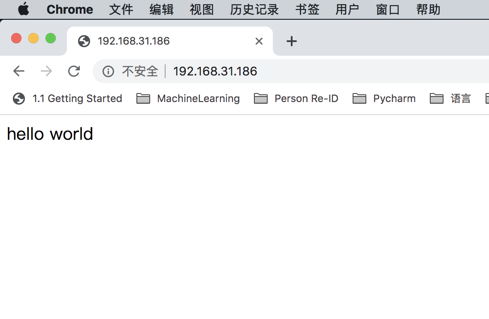
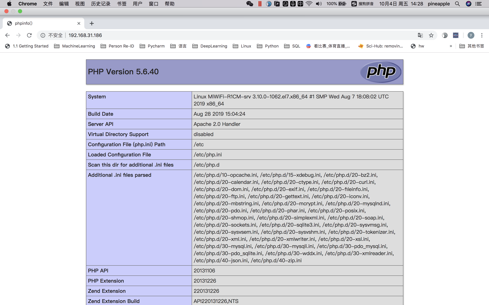
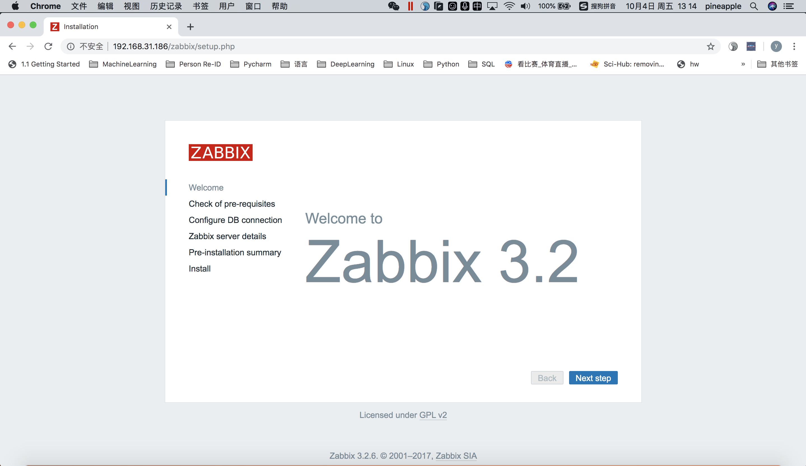
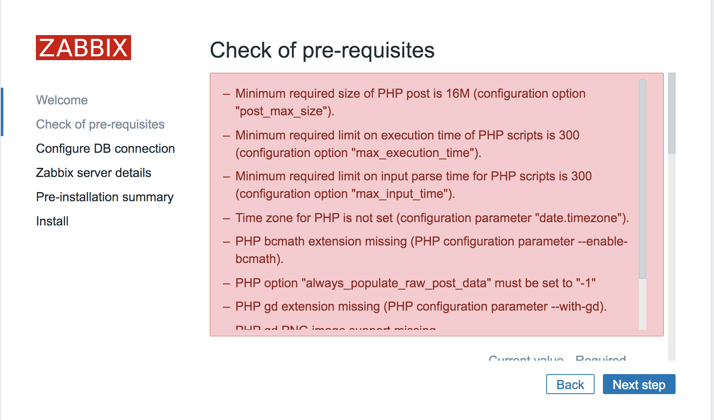
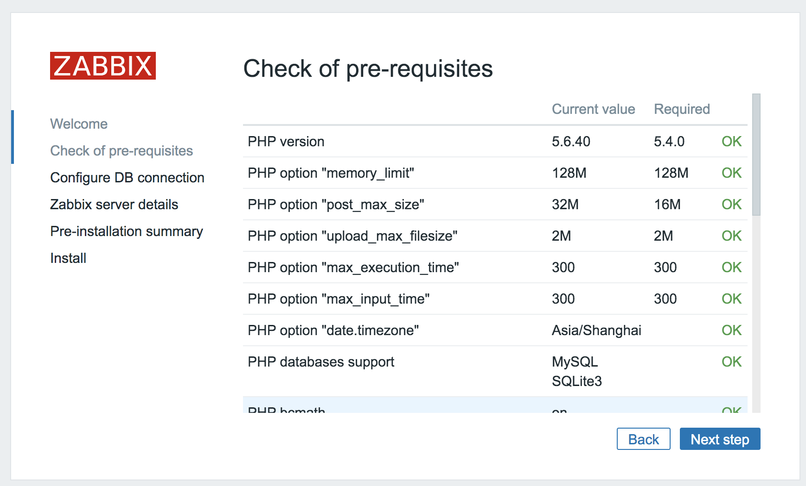
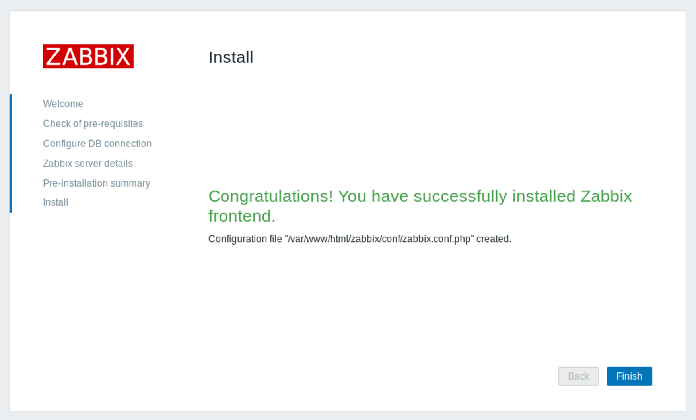
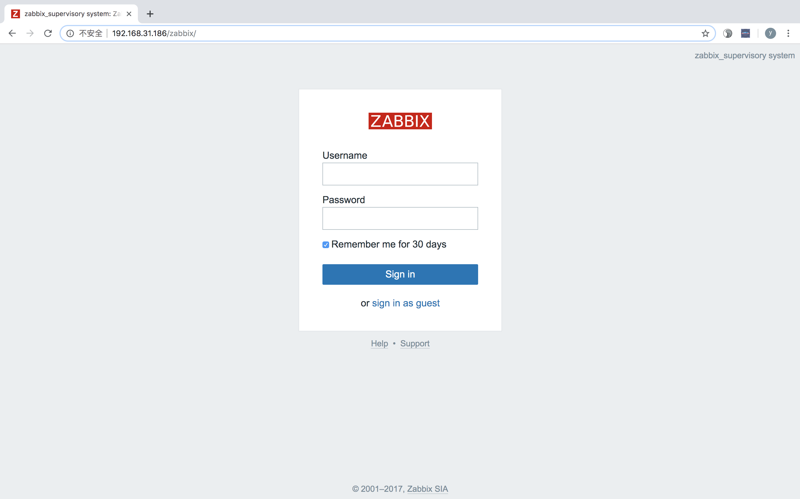
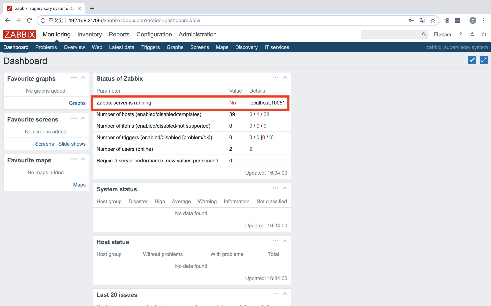
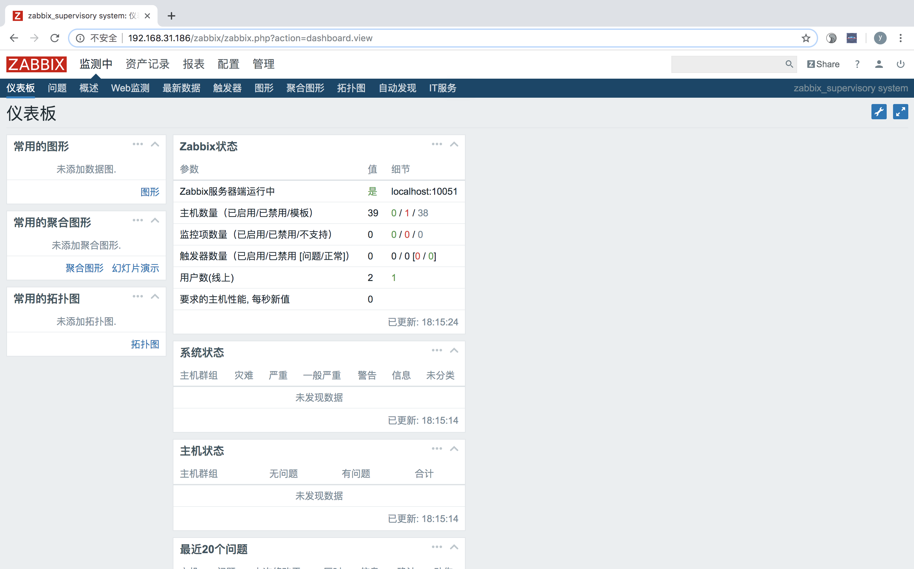

### 实验环境
* server host：       CentOS 7    192.168.31.186
* agent host：&nbsp;  CentOS 7    192.168.31.112

## server host上安装zabbix server源码包

注：源码包没有可运行的bin文件、二进制文件、需要编译才能使用。二进制包可以运行bin文件，直接使用，无需编译。<br>

这里我选择直接安装zabbix3.2.6的版本，去官网找到该版本源码包的下载链接进行下载

```
[pineapple@MiWiFi-R1CM-srv ~]wget  https://sourceforge.net/projects/zabbix/files/ZABBIX%20Latest%20Stable/3.2.6/zabbix-3.2.6.tar.gz/download
--2019-10-03 10:46:40--  https://sourceforge.net/projects/zabbix/files/ZABBIX%20Latest%20Stable/3.2.6/zabbix-3.2.6.tar.gz/download
正在解析主机 sourceforge.net (sourceforge.net)... 216.105.38.13
正在连接 sourceforge.net (sourceforge.net)|216.105.38.13|:443... 已连接。
已发出 HTTP 请求，正在等待回应... 302 Found
位置：https://downloads.sourceforge.net/project/zabbix/ZABBIX%20Latest%20Stable/3.2.6/zabbix-3.2.6.tar.gz?r=&ts=1570070805&use_mirror=jaist [跟随至新的 URL]
--2019-10-03 10:46:46--  https://downloads.sourceforge.net/project/zabbix/ZABBIX%20Latest%20Stable/3.2.6/zabbix-3.2.6.tar.gz?r=&ts=1570070805&use_mirror=jaist
正在解析主机 downloads.sourceforge.net (downloads.sourceforge.net)... 216.105.38.13
正在连接 downloads.sourceforge.net (downloads.sourceforge.net)|216.105.38.13|:443... 已连接。
已发出 HTTP 请求，正在等待回应... 302 Found
位置：https://jaist.dl.sourceforge.net/project/zabbix/ZABBIX%20Latest%20Stable/3.2.6/zabbix-3.2.6.tar.gz [跟随至新的 URL]
--2019-10-03 10:46:51--  https://jaist.dl.sourceforge.net/project/zabbix/ZABBIX%20Latest%20Stable/3.2.6/zabbix-3.2.6.tar.gz
正在解析主机 jaist.dl.sourceforge.net (jaist.dl.sourceforge.net)... 150.65.7.130, 2001:df0:2ed:feed::feed
正在连接 jaist.dl.sourceforge.net (jaist.dl.sourceforge.net)|150.65.7.130|:443... 已连接。
已发出 HTTP 请求，正在等待回应... 200 OK
长度：16008047 (15M) [application/x-gzip]
正在保存至: “download”
100%[======================================>] 16,008,047  39.6KB/s 用时 9m 56s 
2019-10-03 10:56:48 (26.2 KB/s) - 已保存 “download” [16008047/16008047])
[pineapple@MiWiFi-R1CM-srv ~]# ls
Desktop   fontconfig  公共  视频  文档  音乐
download  mymac       模板  图片  下载  桌面
```
下载好的zabbix文件就是download压缩文件，解压之。

```
[pineapple@MiWiFi-R1CM-srv ~]$ tar -xzf download
[pineapple@MiWiFi-R1CM-srv ~]$ ls
Desktop   fontconfig  zabbix-3.2.6  模板  图片  下载  桌面
download  mymac       公共          视频  文档  音乐
[pineapple@MiWiFi-R1CM-srv ~]$ cd zabbix-3.2.6/
[pineapple@MiWiFi-R1CM-srv zabbix-3.2.6]$ ls
aclocal.m4  compile       configure.ac  include      Makefile.in  README
AUTHORS     conf          COPYING       INSTALL      man          sass
bin         config.guess  database      install-sh   misc         src
build       config.sub    depcomp       m4           missing      upgrades
ChangeLog   configure     frontends     Makefile.am  NEWS
```

进入root权限，在zabbix server端下载依赖包

```
[pineapple@MiWiFi-R1CM-srv zabbix-3.2.6]$ su root
密码：
[root@MiWiFi-R1CM-srv zabbix-3.2.6]# yum -y install curl-devel net-snmp net-snmp-devel perl-DBI
```

建立zabbix用户和用户组

```
[root@MiWiFi-R1CM-srv zabbix-3.2.6]# groupadd zabbix; useradd -g zabbix zabbix; usermod -s /sbin/nologin zabbix
```

安装apache(httpd)服务 如果有旧的httpd注意先删除

```
[root@MiWiFi-R1CM-srv zabbix-3.2.6]# rpm -qa | grep httpd  # 确认是否安装了httpd
[root@MiWiFi-R1CM-srv zabbix-3.2.6]# systemctl stop httpd.service   # 如果安装了先停掉httpd服务
[root@MiWiFi-R1CM-srv zabbix-3.2.6]# yum erase httpd.x86_64         # 卸载httpd
[root@MiWiFi-R1CM-srv zabbix-3.2.6]# yum install httpd              # 安装httpd
[root@MiWiFi-R1CM-srv zabbix-3.2.6]# systemctl start httpd.service  # 启动httpd服务
```
注：apache的默认部署路径是/var/www/html/，我们可以在这个目录下建立一个简易的index.html文件来验证apach服务是否正常开启

```
[root@MiWiFi-R1CM-srv zabbix-3.2.6]#echo 'hello world' > /var/www/html/index.html
```
打开web，访问该server host的ip地址，即**http://192.168.31.186** 出现hello world就表示apache服务正常启动。<br>


安装php5.6 如果有旧的php注意先删除

```
[root@MiWiFi-R1CM-srv zabbix-3.2.6]# yum list installed | grep php  # 检查当前安装的PHP包
[root@MiWiFi-R1CM-srv zabbix-3.2.6]# yum remove php.x86_64 php-cli.x86_64 php-common.x86_64 php-gd.x86_64 php-ldap.x86_64 php-mbstring.x86_64 php-mcrypt.x86_64 php-mysql.x86_64 php-pdo.x86_64  # 如果有旧php包就删除
[root@MiWiFi-R1CM-srv zabbix-3.2.6]# yum install epel-release
[root@MiWiFi-R1CM-srv zabbix-3.2.6]# rpm -ivh http://rpms.famillecollet.com/enterprise/remi-release-7.rpm   # 配置yum源
[root@MiWiFi-R1CM-srv zabbix-3.2.6]# yum list --enablerepo=remi --enablerepo=remi-php56 | grep php    # 使用yum list命令查看可安装的包
[root@MiWiFi-R1CM-srv zabbix-3.2.6]# yum install --enablerepo=remi --enablerepo=remi-php56 php php-opcache php-devel php-mbstring php-mcrypt php-mysqlnd php-phpunit-PHPUnit php-pecl-xdebug php-pecl-xhpr  # 安装PHP5.6  
[root@MiWiFi-R1CM-srv zabbix-3.2.6]# php --version
[root@MiWiFi-R1CM-srv zabbix-3.2.6]# yum install --enablerepo=remi --enablerepo=remi-php56 php-fpm   # 安装PHP-fpm
``` 
注：我们可以在apache默认部署路径/var/www/html/下建立一个简易的phpinfo.php文件然后打开web端来验证php是否安装成功，能够适配apache。

```
 # 在/var/www/html/路径下创建一个phpinfo.php文件
[root@MiWiFi-R1CM-srv html]# echo '<?php phpinfo() ?>' > phpinfo.php
 
 # 先备份，再修改httpd的配置文件
[root@MiWiFi-R1CM-srv html]# cp /etc/httpd/conf/httpd.conf /etc/httpd/conf/httpd.conf.bak
[root@MiWiFi-R1CM-srv html]# vi /etc/httpd/conf/httpd.conf

 # 找到httpd.conf文件中如下的代码块，在DirectoryIndex最后加上刚刚创建的phpinfo.php文件
<IfModule dir_module>
    DirectoryIndex index.php index.html phpinfo.php
</IfModule>

 # 重启httpd服务
[root@MiWiFi-R1CM-srv html]# systemctl restart httpd.service
```

打开web，访问该server host的ip地址，即**http://192.168.31.186** 出现下图就表示apache服务正常启动。<br>


 
 
 安装mysql

``` 
[root@MiWiFi-R1CM-srv yum.repos.d]# yum install mariadb mariadb-server mariadb-devel -y

```

开始编译：./congfigure预编译, Make编译, Make install安装

```
[root@MiWiFi-R1CM-srv zabbix-3.2.6]# ./configure --prefix=/usr/local/zabbix/ --enable-server --enable-agent --with-mysql \
> --enable-ipv6 --with-net-snmp --with-libcurl
[root@MiWiFi-R1CM-srv zabbix-3.2.6]# make
[root@MiWiFi-R1CM-srv zabbix-3.2.6]# make install
 # 建立软连接
[root@MiWiFi-R1CM-srv zabbix-3.2.6]# ln -s /usr/local/zabbix/sbin/zabbix_* /usr/local/sbin/
```

配置zabbix

```
[root@MiWiFi-R1CM-srv zabbix-3.2.6]# cd /usr/local/zabbix/etc
[root@MiWiFi-R1CM-srv etc]# cp zabbix_server.conf zabbix_server.conf.bak
[root@MiWiFi-R1CM-srv etc]# vi zabbix_server.conf
```

```
# zabbix_server.conf 修改下列几项
LogFile=/tmp/zabbix_server.log
DBHost=localhost
DBName=zabbix
DBUser=zabbix
DBPassword=123456
```

将zabbix_server启动脚本拷贝到`/etc/init.d/`目录，赋权，然后启动zabbix服务

```
[root@MiWiFi-R1CM-srv etc]# cp /home/pineapple/zabbix-3.2.6/misc/init.d/tru64/zabbix_server /etc/init.d/zabbix_server
[root@MiWiFi-R1CM-srv etc]# chmod o+x /etc/init.d/zabbix_server 
[root@MiWiFi-R1CM-srv etc]# /etc/init.d/zabbix_server start
```

配置mysql数据库

```
 # 启动mysql服务
[root@MiWiFi-R1CM-srv /]# systemctl restart mariadb.service
[root@MiWiFi-R1CM-srv /]# mysql
Welcome to the MariaDB monitor.  Commands end with ; or \g.
Your MariaDB connection id is 9
Server version: 5.5.64-MariaDB MariaDB Server

Copyright (c) 2000, 2018, Oracle, MariaDB Corporation Ab and others.

Type 'help;' or '\h' for help. Type '\c' to clear the current input statement.

MariaDB [(none)]> show database;
ERROR 1064 (42000): You have an error in your SQL syntax; check the manual that corresponds to your MariaDB server version for the right syntax to use near 'database' at line 1
MariaDB [(none)]> show databases;
+--------------------+
| Database           |
+--------------------+
| information_schema |
| mysql              |
| performance_schema |
| test               |
+--------------------+
4 rows in set (0.00 sec)

 # 创建zabbix数据库
MariaDB [(none)]> create database zabbix charset=utf8;
Query OK, 1 row affected (0.00 sec)

 # 执行授权命令
MariaDB [(none)]> grant all on zabbix.* to zabbix@localhost identified by '123456';
Query OK, 0 rows affected (0.00 sec)
MariaDB [(none)]> flush privileges;
Query OK, 0 rows affected (0.00 sec)

 # 将zabbix集成SQL文件导入zabbix数据库
[root@MiWiFi-R1CM-srv /]# cd /home/pineapple/zabbix-3.2.6/
[root@MiWiFi-R1CM-srv zabbix-3.2.6]# mysql -uzabbix -p123456 zabbix < database/mysql/schema.sql
[root@MiWiFi-R1CM-srv zabbix-3.2.6]# mysql -uzabbix -p123456 zabbix < database/mysql/images.sql
[root@MiWiFi-R1CM-srv zabbix-3.2.6]# mysql -uzabbix -p123456 zabbix < database/mysql/data.sql

 # 以zabbix身份进入mysql数据库，查看zabbix数据库中的表信息，如果出现很多表，就表示导入zabbix集成数据库成功。
[root@MiWiFi-R1CM-srv html]# mysql -uzabbix -p123456 zabbix
Reading table information for completion of table and column names
You can turn off this feature to get a quicker startup with -A

Welcome to the MariaDB monitor.  Commands end with ; or \g.
Your MariaDB connection id is 155
Server version: 5.5.64-MariaDB MariaDB Server

Copyright (c) 2000, 2018, Oracle, MariaDB Corporation Ab and others.

Type 'help;' or '\h' for help. Type '\c' to clear the current input statement.

MariaDB [zabbix]> show tables;
+----------------------------+
| Tables_in_zabbix           |
+----------------------------+
| acknowledges               |
| actions                    |
| alerts                     |
| application_discovery      |
| application_prototype      |
...
```

部署web页面

```
 # 将zabbix的web页面拷贝到apache默认发布目录/var/www/html/zabbix中
[root@MiWiFi-R1CM-srv zabbix-3.2.6]# cp -r ./frontends/php/ /var/www/html/zabbix
```

```
 # 重启zabbix服务
[root@MiWiFi-R1CM-srv html]# /etc/init.d/zabbix_server restart
 # 重启apache服务
[root@MiWiFi-R1CM-srv html]# systemctl restart httpd.service
 # 重启mysql服务
[root@MiWiFi-R1CM-srv html]# systemctl restart mariadb.service
```

server host的ip地址是192.168.31.186。<br>
在web端访问**http://192.168.31.186/zabbix/** 就可以访问zabbix的web配置页面了。<br>


## 在zabbix的web GUI端继续配置
在web端访问http://192.168.31.186/zabbix/，点击右下角Next step。发现依赖检查出现报错，需要修复。

下拉右边的滑块，可以看到zabbix它要求的配置和现有server host的配置，我们就需要针对这个表信息将这些不满足的Fail项一一解决。

|             | Current value  | Required |    |
|:------------|:--------------:|:--------:|---:|
| PHP version |     5.6.40     |  5.4.0   | OK |
| PHP option "memory_limit" | 128M | 128M | OK |
| PHP option "post\_max_size" | 8M | 16M | Fail |
| PHP option "upload\_max_filesize" | 2M | 2M | OK |
| PHP option "max\_execution_time" | 30 | 300 | Fail |
| PHP option "max\_input_time" | 60 | 300 | Fail |
| PHP option "date.timezone" | unknown | | Fail |
| PHP databases support	| MySQL SQLite3| | OK |
| PHP bcmath | off | | Fail |
| PHP mbstring | on | | OK |
| PHP option "mbstring.func\_overload" | off | off | OK |
| PHP option "always\_populate_raw_post_data"| on | off | Fail |
| PHP sockets | on | OK |
| PHP gd | unknown | 2.0 | Fail |
| PHP gd PNG support | off	 | | Fail |
| PHP gd JPEG support | off |	| Fail |
| PHP gd FreeType support | off | | Fail |
| PHP libxml | 2.9.1 | 2.6.15 | OK |
| PHP xmlwriter | on | | OK |
| PHP xmlreader	|on	 | | OK |
| PHP ctype | on	| | OK |
| PHP session	 | on | | OK |
| PHP option "session.auto_start" | off	| off | OK |
| PHP gettext	 | on | | OK |
| PHP option "arg_separator.output" | & | & | OK |

针对PHP option的四个错误 "post\_max\_size"、"max\_execution\_time"、 "max\_input\_time"和"date.timezone"，可以通过修改`/etc/php.ini`配置文件来矫正，将该配置文件中对应项改成要求的就可以了，其中时区"date.timezone"修改为Asia/Shanghai.

```
[root@MiWiFi-R1CM-srv html]# sed -i "s/;date.timezone =/date.timezone = Asia\/Shanghai/g" /etc/php.ini
[root@MiWiFi-R1CM-srv html]# sed -i "s#max_execution_time = 30#max_execution_time = 300#g" /etc/php.ini
[root@MiWiFi-R1CM-srv html]# sed -i "s#post_max_size = 8M#post_max_size = 32M#g" /etc/php.ini
[root@MiWiFi-R1CM-srv html]# sed -i "s#max_input_time = 60#max_input_time = 300#g" /etc/php.ini
[root@MiWiFi-R1CM-srv html]# sed -i "s#memory_limit = 128M#memory_limit = 128M#g" /etc/php.ini
[root@MiWiFi-R1CM-srv html]# sed -i "/;mbstring.func_overload = 0/a;mbstring.func_overload = 2\n" /etc/php.ini
[root@MiWiFi-R1CM-srv html]# sed -i "s#;always_populate_raw_post_data = -1#always_populate_raw_post_data = -1#g" /etc/php.ini
 # 重启httpd服务
[root@MiWiFi-R1CM-srv html]# systemctl restart httpd.service 
```

接下来将php的bcmath和gd组件安装上

```
[root@MiWiFi-R1CM-srv html]# yum install --enablerepo=remi --enablerepo=remi-php56 php56w-bcmath php56w-gd
 # 重启httpd服务
[root@MiWiFi-R1CM-srv html]# systemctl restart httpd.service 
```

在web端重新访问**http://192.168.31.186/zabbix/** ，可以看到所有错误都已修复。


在最后一步中zabbix无法在`/var/www/html/zabbix/conf/`目录中无法创建**zabbix.conf.php**，所以我们需要点击链接下载**zabbix.conf.php**，然后移动到`/var/www/html/zabbix/conf/`目录下，点击finish完成。


## 进入zabbix server的Web GUI界面
跟着上一步点击finish或者再次在web端访问http://192.168.31.186/zabbix，就会进入zabbix的web端登录界面，用户名admin，密码zabbix。




#### 等等！上图中显示zabbix server is not running ！，浏览了zabbix的日志文件发现没有报错，可能是因为selinux开启了，使用命令`setenforce 0`将selinux设置为permissive模式 ，刷新zabbix就可以看到zabbix server is running！了

注：server host防火墙应该开放端口10051，或者关闭防火墙，否则数据不通。



## agent host上安装zabbix agent端

现在我们需要在其他被监控的机器上去安装zabbix agent端，我这里的agent host IP地址是192.168.31.112，安装zabbix agent端还是使用安装server端时使用的源码包，将第一步中下载的zabbix源码包download拷贝到agent host上，解压之。

```
[root@localhost pineapple]# tar xzf download
[root@localhost pineapple]#cd zabbix-3.2.6
# 执行编译：./congfigure预编译, Make编译, Make install安装
[root@localhost zabbix-3.2.6]#./configure --prefix=/usr/local/zabbix --enable-agent
[root@localhost zabbix-3.2.6]#make
[root@localhost zabbix-3.2.6]#make install
# 建立软链接
[root@localhost zabbix-3.2.6]# ln -s /usr/local/zabbix/sbin/zabbix_* /usr/local/sbin/

# 加入系统服务
[root@localhost zabbix-3.2.6]# cp misc/init.d/tru64/zabbix_agentd /etc/init.d/zabbix_agentd
[root@localhost zabbix-3.2.6]# chmod o+x /etc/init.d/zabbix_agentd

# 建立zabbix用户，然后启动服务，因为root用户不能启动zabbix_agentd服务
[root@localhost zabbix-3.2.6]# useradd zabbix
[root@localhost zabbix-3.2.6]# /etc/init.d/zabbix_agentd start

```
配置zabbix agent端，其中Server和ServerActive指向zabbix server端IP，Hostname为自己zabbix agent端的IP。

```
[root@localhost zabbix-3.2.6]# vi /usr/local/zabbix/etc/zabbix_agentd.conf

```
```
## zabbix_agentd.conf 
LogFile=/tmp/zabbix_agentd.log
Server=192.168.31.186
ServerActive=192.168.31.186
Hostname=192.168.31.112
```

```
# 重启zabbix agent服务
[root@localhost zabbix-3.2.6]# /etc/init.d/zabbix_agentd restart
```

注：agent host防火墙的应该开放端口10050，或者直接关闭防火墙，否则数据不通。

## 总结
1. zabbix的安装分为server端和agent端两个部分，源码安装方式需要在预编译的时候用参数**--enable-agent**和**--enable-server**来选择。
2. server端的zabbix源码安装思路：<br>
	安装相关依赖包 —> 建立zabbix用户 —> 安装配置apache —> 安装配置php —> 安装数据库mysql —> 编译配置zabbix —> 配置数据库 —> 部署配置zabbix server web端<br>
3. angent端的zabbix源码安装思路：<br>
	编译zabbix --enable-agent —> 建立软链接 —> 加入系统服务 —> 建立zabbix用户 —> 配置zabbix

### 至此，我们完成了zabbix server端的安装和配置，接下来：
* 了解zabbix是如何对不同的host进行监控的
* 在zabbix server端进行个人定制化监控设置
