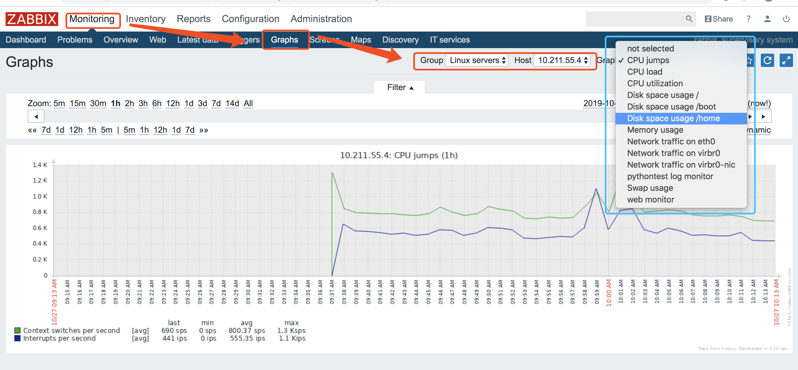
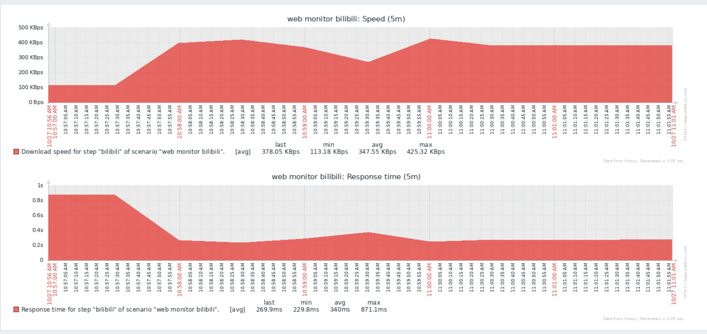

# Zabbix监控数据查看
* Latest data 
	* 查看主机监控的最新数据
* Graphs
	* 查看模板graph数据
	* 自定义graph图表
* Screens
	* 自定义screen
* Web监控
	* 新建web监控项
	* 查看web监控数据 

## Latest data
Zabbix web管理界面提供了直接查看host各个监控项的最新值。 

如果我们点击了cpu user time项的graph就可以直接看到cpu user time监控项的图形信息。

## Graphs

### Graph 模板图形
zabbix的监控模板同样也提供了许多预制图形，他们直接在套用监控模板时就生成了，比如下图中的cpu线程的情况(cpu jumps)。

### 自定义Graph图表

如果我现在想直接观察这台主机的cpu的用户使用情况，那我需要自定义创建graph。

## Screens
Screens相当于一个展示看板，你可以在一个页面中自定义你想看到的内容，这些内容可以是图片，图表，文字，网页链接的集合。而且你还可以设置这些元素的摆放位置(自由度并不高)。 

我创建了一个zabbix server的screen，其中包括cpu利用率和负载率、时钟、自定义的两个监控项图形。

## Web监控
web监控是需要实现手动添加监控项的，否则你是看不到监控图形，如下图所示：

### 新建web监控项
然后我们需要手动创建一个web监控项，这里就创建一个web监控bilibili吧。

### 查看web监控数据
web监控项设置好了之后，就可以去Monitoring里面查看数据了

