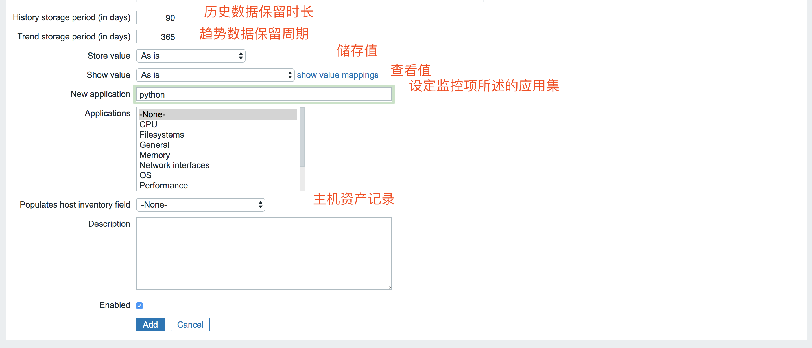
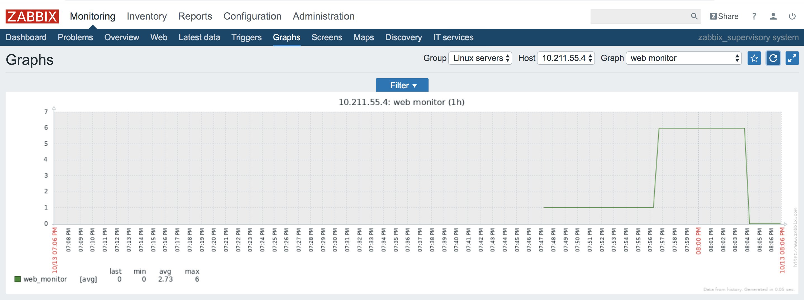

### 实验环境
* Server host: CentOS7 10.211.55.4
* Agent host:  CentOS7 10.211.55.4
* Zabbix 3.2.6

## zabbix自定义监控项
实际工作中，总会遇到一些自定义监控项情况，zabbix自定义监控也非常简单，通过自定义添加key来实现。<br>
##### 情况模拟：
我用python写了一个脚本，启动脚本后，它会自动在脚本当前目录下每隔1秒钟往pyhtontext.log文件中逐行递归依次写入0-99一共100个数字，然后我让zabbix来监控pythontext.log文件中的最后一行，一旦最后一行的值为95，就实现告警。

##### 实际操作：
我们的思路是通过使用shell脚本执行linux命令`tail -n 1 /home/pineapple/pythontest/pythontest.log`来查看最后一行的输出结果。此处在`/home/pineapple/pythontest/`目录下来写这个脚本文件pythontest\_log_monitor.sh。

```
#!/bin/bash
#by pineapple
#20191013 auto monitor pythontest.log
tail -n 1 /home/pineapple/pythontest/pythontest.log
```

如果你尝试执行这个shell脚本就会返回pythontest.log文件的最后一行内容

```
[root@MiWiFi-R1CM-srv pythontest]# sh /home/pineapple/pythontest/pythontest_log_monitor.sh 
4
```

接下来，到客户端`/usr/local/zabbix/etc/zabbix_agentd.conf`配置文件中添加key值，逗号前面为这个监控项key的名称，逗号后面为key的值，原理是执行逗号后面的shell语句，然后将得到的值赋值给逗号前面的key名称

```
UserParameter=pythontest_log_monitor,sh /home/pineapple/pythontest/pythontest_log_monitor.sh
```

重启server_agentd服务

```
[root@MiWiFi-R1CM-srv pythontest]# /etc/init.d/zabbix_agentd  restart
```

现在可以调用zabbix_get来检验zabbix\_agent是否已经监控pythontest.log文件了。返回出值则表示pythontest.log已经成功被监控。(如果提示pythontest\_log\_monitor.sh的权限不够，可能是因为zabbix监控时是用zabbix用户去执行命令了，所以需要将python\_test\_log\_monitor.sh、pythontest.log的owner修改为zabbix。)

```
[root@MiWiFi-R1CM-srv pythontest]# /usr/local/zabbix/bin/zabbix_get -s 10.211.55.4 -k pythontest_log_monitor
4
```

现在agent端已经监控到了，需要到server端的web界面添加监控项




然后回到configuration -> Hosts页面就可以找到自定义添加的pythontest_log_monitor监控项了


现在我们再给这个监控项添加一个图来实时展示


然后回到monitoring -> Graphs 选择对应的host和图形就看看到自定义监控项pythontest_log_monitor的图象了


最后我们给pythonest_log_monitor监控项添加一个告警的触发器


到这里我们 自定义监控项 -> 创建监控项图形 -> 添加触发器 就全部<font size=5>大功告成</font>，我们可以随意调整pythontest.log文件的最后一行来验证zabbix监控和触发器是否响应，并且观察web端首页的dashboard和Monitoring -> Problems下的问题记录，还有Monitoring -> Graphs来观察zabbix监控的内容。


## zabbix自定义添加网络监控项

##### 情况模拟
现在我们想要利用zabbix监控某个网址的关键词，判断网站有没有被恶意篡改。现在在10.211.55.4这台机器上安装了apache，开启apache服务后，这台机器就成了web服务器，我们可以在局域网内访问 **http://10.211.55.4** 这个网址。按照apache的默认配置，我们所看到的网页就是在`10.211.55.4:/var/www/html/index.html`,因为之前安装zabbix server端，对apache服务进行了一些配置(详情可以查看[zabbix源码安装配置实例](https://github.com/pppineapple/Zabbix-Note/blob/master/zabbix%E6%BA%90%E7%A0%81%E5%8C%85%E5%AE%89%E8%A3%85%E9%85%8D%E7%BD%AE/zabbix%E5%AE%89%E8%A3%85%E5%AE%9E%E4%BE%8B.md)), 现在我将apache配置文件`/etc/httpd/conf/httpd.conf`中的默认首页代码块做了如下修改:

```
<IfModule dir_module>
    DirectoryIndex index.php index.html phpinfo.php
</IfModule>
```

这个代码块表示的是：我如果访问 **http://10.211.55.4** ,apache将会到`/var/www/html/`目录下去按照**index.php**、**index.html**、**phpinfo.php**这个顺序去寻找这三个文件作为网页展示出来，如果找到了index.php，那就会直接显示index.php的内容，如果没有找到index.php，就会去寻找index.html。如果三个都没找到，那就会返回404。

然后我再`/var/www/html/`目录下新建index.php文件，内容如下：

```
<h1>Hello World</h1>
<?php phpinfo() ?>
```
然后在重启apache服务`[root@centos-linux html]# systemctl restart httpd.service `
访问 **http://10.211.55.4** ，就会看到如下网页：


注：这里第一行的**Hello World**就是index.php文件中的`<h1>Hello World</h1>`，剩下的内容就是index.php文件中的`<?php phpinfo() ?>`所输出的内容。<br>

<font size=5>现在我们就要使用zabbix监控的就是这个网页的**Hello World**字符串，确保它不发生变化，如果它发生变化，就要产生告警。</font>

##### 实际操作
使用shell脚本监控网页的关键词**Hello World**，在`/home/pineapple/web_monitor`目录下新建shell脚本web_monitor.sh。这个脚本就是利用linux命令`curl -s $WEBSITE | grep -c "Hello World"`来访问`$WEBSITE`，再查找其中的**Hello World**词，统计**Hello World**的个数。其中`$WEBSITE`在shell脚本中是变量，代表 http://10.211.55.4/ 。

```
#!/bin/bash
#by pineapple
#20191013 auto monitor http://10.211.55.4

WEBSITE="http://10.211.55.4/"
NUM=`curl -s $WEBSITE | grep -c "Hello World"`
echo $NUM
```
我们可以实际在linux中运行这个shell脚本，返回值为1。

```
[root@centos-linux web_monitor]# sh web_monitor.sh 
1
```

剩下的就和前一部分的自定义监控项基本相同了，到客户端`/usr/local/zabbix/etc/zabbix_agentd.conf`配置文件中添加key值。

```
UserParameter=web_monitor,sh /home/pineapple/web_monitor/web_monitor.sh
```
重启server\_agentd服务，然后利用zabbix\_get工具查看agent端是否成功添加了web\_monitor，可以看到输出，并且输出为1，就说明agent端成功添加了web_monitor监控项，并且目前 **http://10.211.55.4** 是正常的。

```
[root@centos-linux etc]# /etc/init.d/zabbix_agentd  restart
[root@centos-linux etc]# /usr/local/zabbix/bin/zabbix_get -s 10.211.55.4 -k web_monitor
1
```

然后到server端的web界面中添加web\_monitor监控项，然后添加图形和触发器。这些步骤和前一部分相同，就不在赘述了。我们直接看看修改一下 10.211.55.4/var/www/html/index.php中的**Hello World**的个数，zabbix监控项会发生什么变化。

* 正常情况下，**http://10.211.55.4** 网页如下所示：
 

 zabbix的web_monitor监控项图像如下所示：都是1，表示网页正常。
 

* 网页被篡改，**http://10.211.55.4** 网页如下所示: 
 

 zabbix的web_monitor监控项图像如下所示：图形从1，跳跃到6，最后下降到0，表示网页进过了两次篡改。第一次篡改为6个**Hello World**，第二次篡改直接删除了**Hello World**字符串。
 
 
 zabbix的告警如下所示：
 
 
* 网页修改到正常页面，**http://10.211.55.4** 网页如下所示：
 
 
 zabbix的web_monitor监控项图像如下所示：图形曲线回到了1
 
 
 zabbix的告警如下所示：显示为绿色resovled
 
 
## 总结
本文所介绍的zabbix添加自定义监控项，都是基于shell脚本、linux命令和相关程序、服务的输出结果来进行监控，基本步骤是：编写shell脚本 -> agent端配置文件添加自定义监控项 -> server端的web界面添加监控项 -> 必要时建立图行和触发器 (-> 设置对应时间触发之后执行的动作)。

## 接下来
* 理解监控事件的不同等级
* 设置触发器响应之后的Action


 
