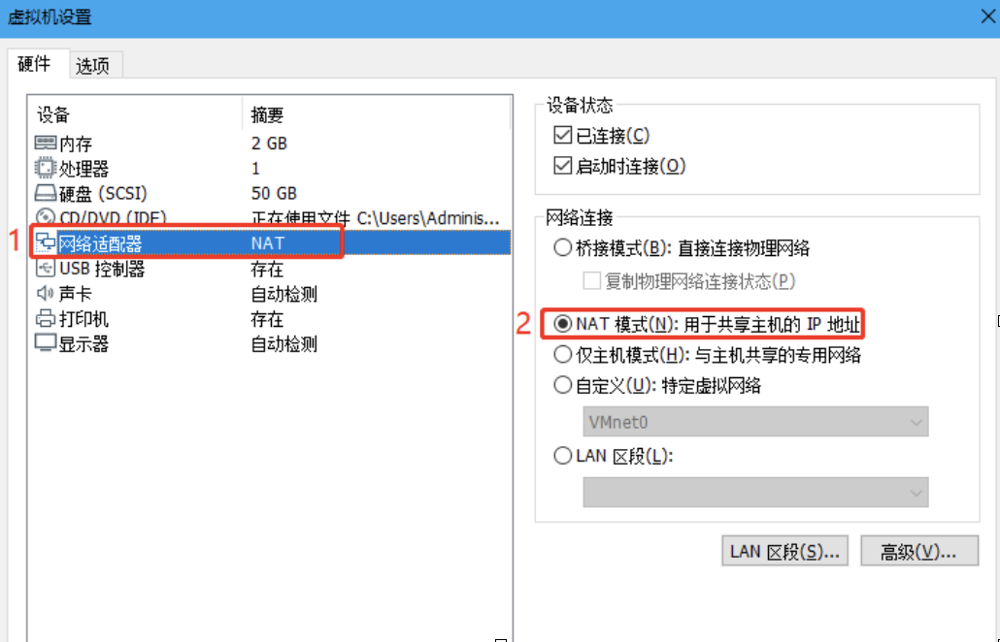
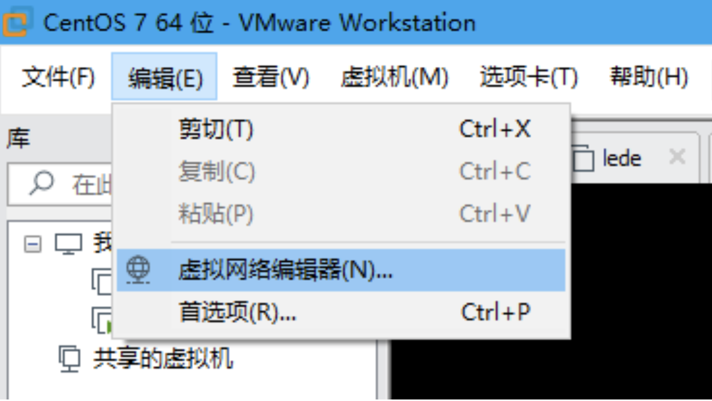
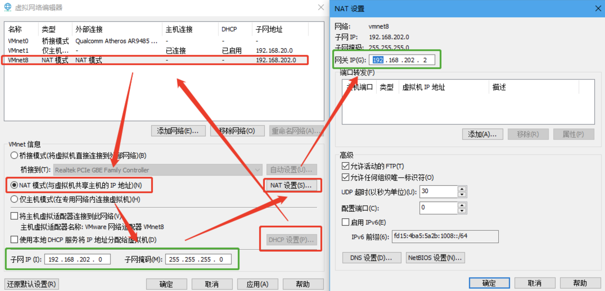

# VMware虚拟机联网
VMware安装linux虚拟机之后，linux虚拟机联网需要进行一些相关配置文件的修改。虚拟机网络配置主要分为：桥接模式、NAT模式(共享主机的IP地址)和only-host模式(与主机共享的专用网络)。这里主要介绍通过NAT模型实现linux虚拟机联网。

## 实验环境
* VMware Workstation 15
* CentOS 7

## 具体步骤
1. 首先在VMware软件中将linux虚拟机的网络模式设置为NAT
	
2. 打开VMware软件中的**虚拟网络编辑器**记录下IP、子网掩码、网关。这三个信息将是后续linux虚拟机配置文件要修改的内容。
	
	
3. linux中网络配置文件位于`/etc/sysconfig/network-scripts/`路径下，所以要先以root权限进入到该路径下.<br>

	```
[root@localhost pineapple]# cd /etc/sysconfig/network-scripts/
[root@localhost network-scripts]# ls
ifcfg-ens33          ifdown-isdn      ifup-bnep   ifup-routes
ifcfg-ens33.bat      ifdown-post      ifup-eth    ifup-sit
ifcfg-ens33.bat.bat  ifdown-ppp       ifup-ib     ifup-Team
ifcfg-lo             ifdown-routes    ifup-ippp   ifup-TeamPort
ifdown               ifdown-sit       ifup-ipv6   ifup-tunnel
ifdown-bnep          ifdown-Team      ifup-isdn   ifup-wireless
ifdown-eth           ifdown-TeamPort  ifup-plip   init.ipv6-global
ifdown-ib            ifdown-tunnel    ifup-plusb  network-functions
ifdown-ippp          ifup             ifup-post   network-functions-ipv6
ifdown-ipv6          ifup-aliases     ifup-ppp
[root@localhost network-scripts]# 
	``` 
	其中该目录下ifcfg-ens33就是虚拟机的网卡配置文件。不同的操作系统文件名可能不同。<br>

4. 修改ifcfg-ens33配置文件的内容，并保存。<br>
	
	```
TYPE=Ethernet
PROXY_METHOD=none
BROWSER_ONLY=no
BOOTPROTO=static           # dhcp->static
DEFROUTE=yes
IPV4_FAILURE_FATAL=no
IPV6INIT=yes
IPV6_AUTOCONF=yes
IPV6_DEFROUTE=yes
IPV6_FAILURE_FATAL=no
IPV6_ADDR_GEN_MODE=stable-privacy
NAME=ens33
DEVICE=ens33
ONBOOT=yes                 # 是否开机启动，no->yes
IPADDR=192.168.202.101     # IP地址，前三位修改为第二步中查到IP地址对应项，最后一位从3-254中任意设置，此处设置为101
NETMASK=255.255.255.0      # 子网掩码，同第二步中查到的子网掩码
GATEWAY=192.168.202.2      # 网关地址，同第二步中查到的网关地址
DNS1=114.114.114.114       # 备用DNS1
DNS2=8.8.8.8	           # 备用DNS2
```
	ifcfg-ens33文件中去除了HWADDR和UUID，他们分别是mac地址和uuid标识<br>
5. 进入目录`/etc/udev/rules.d/`中删除**70-persistent-net.rules**文件，因为这是一个绑定mac地址的文件，在我们之前的配置文件ifcfg-ens33中，将mac地址项删除了，所以这个文件也要删除。<br>

	```
[root@localhost ~]# cd /etc/sysconfig/network-scripts/
[root@localhost network-scripts]# cd /etc/udev/rules.d/
[root@localhost rules.d]# ls
70-persistent-net.rules
[root@localhost rules.d]# rm 70-persistent-net.rules
[root@localhost rules.d]# 
	```
6. 重启虚拟机。既可以ping通外网了。<br>
	
	```
[root@localhost ~]# ping www.baidu.com
PING www.a.shifen.com (183.232.231.174): 56 data bytes
64 bytes from 183.232.231.174: icmp_seq=0 ttl=54 time=20.371 ms
64 bytes from 183.232.231.174: icmp_seq=1 ttl=54 time=21.808 ms
64 bytes from 183.232.231.174: icmp_seq=2 ttl=54 time=22.468 ms
	```


